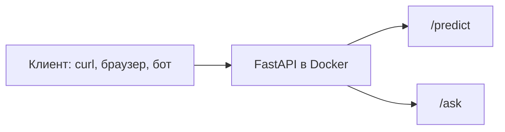

# Разработка кроссплатформенных приложений

Вводное занятие

---
layout: default
---

# О чём этот курс

Курс про Python — на уровне, которого хватает для реальных сервисов: с веб-API,
контейнерами, нейросетями и языковыми моделями.

«Кроссплатформенность» здесь означает:

<v-clicks>

- Сервис работает как контейнер с HTTP-интерфейсом
- Обратиться к нему может браузер, мобильное приложение или скрипт
- Или Telegram-бот — интерфейс тот же самый, HTTP

</v-clicks>

---
layout: default
---

# Как это выглядит в итоге

К концу курса — один Docker Compose-проект с двумя эндпоинтами: `/predict`
возвращает класс изображения, `/ask` отвечает на вопрос по базе документов.

<v-clicks>

- Docker здесь упаковывает приложение вместе со всем окружением — так оно одинаково запускается на любой машине
- Обернуть это API в Telegram-бота можно отдельным заданием со звёздочкой — в основную программу оно не входит

</v-clicks>

---
layout: default
---

# Дорожная карта

| # | Раздел | Суть |
|---|---|---|
| I | Python: профессиональный уровень | Память, GIL (Global Interpreter Lock), ООП, декораторы, тестирование |
| II | Асинхронность и контейнеризация | asyncio, Docker, FastAPI |
| III | Глубокое обучение и CV (компьютерное зрение) | PyTorch, transfer learning, деплой модели |
| IV | LLM (большие языковые модели) и RAG (ответы на основе найденных документов) | Промптинг, агенты, векторные БД, интеграция всего вместе |

<v-click>

Разделы идут по порядку: контейнер из раздела II используется в разделе III
и IV для модели и RAG.

</v-click>

---
layout: fact
---

# 92

часа всего — 38 теории, 54 лабораторных, 20 лабораторных работ

---
layout: two-cols
---

# Нужно знать заранее

<v-clicks>

- Базовый синтаксис Python
- Материал курсов «Инструментальное программное обеспечение» и «Основы алгоритмизации и программирования»

</v-clicks>

Если что-то подзабылось — стоит освежить в первую неделю.

::right::

# Не будет

<v-clicks>

- Строгого вывода формул — только смысл
- Обучения своих языковых моделей, работаем через готовые API
- Разработки под iOS/Android
- Сравнения фреймворков: стек — Python, FastAPI, PyTorch

</v-clicks>

---
layout: default
---

# Оценивание

<v-clicks>

- Итоговая отметка — по 10-балльной шкале
- Две обязательные контрольные работы за курс
- В каждой лабораторной — минимум для зачёта и отдельные пункты на «отлично»
- На 9–10 баллов рассчитывают, если решение самостоятельное и не по шаблону

</v-clicks>

---
layout: center
---

# Что дальше

Первая тема — управление памятью в Python и GIL. Дальше — первая лабораторная:
сравнение подходов к параллельному выполнению.

---
layout: end
---

# Конец