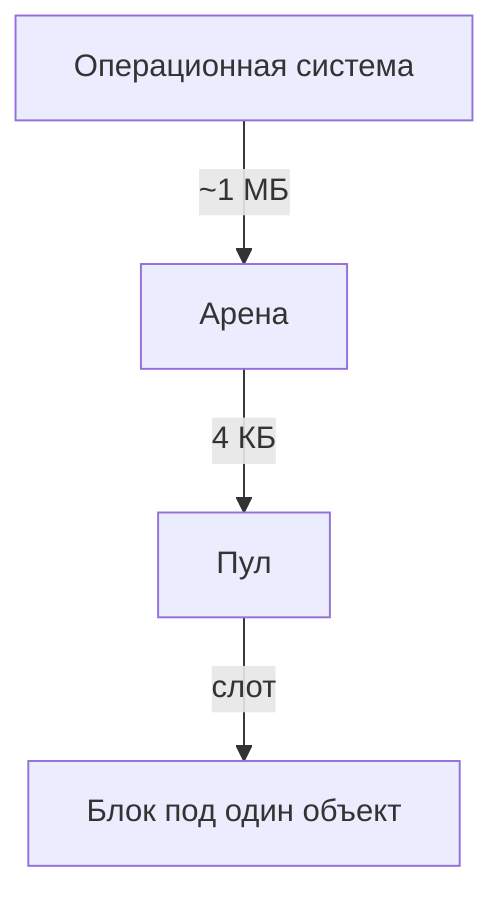
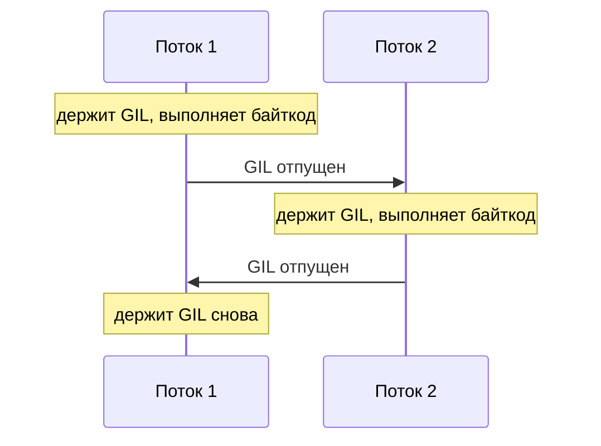

# 1.1. Управление памятью в Python

Сборщик мусора, блокировка интерпретатора, потоки

---
layout: default
---

# Зачем это знать

В Python нет `malloc`/`free` — память выделяется и освобождается сама. Из-за
этого возникает ощущение, что об управлении памятью думать вообще не нужно.

На практике это не так: память процесса иногда не падает после удаления
объектов, циклические ссылки не убираются мгновенно, а `threading` неожиданно
не ускоряет вычисления. У всего этого есть конкретный механизм — сегодня
разбираем, какой именно.

---
layout: default
---

# План на сегодня

<v-clicks>

- Подсчёт ссылок — как Python вообще понимает, что объект больше не нужен
- Сборщик мусора — что происходит, когда подсчёт ссылок не справляется
- Арены и пулы — откуда Python берёт память для мелких объектов
- GIL — почему только один поток исполняет байткод одновременно
- threading vs multiprocessing — что из этого реально ускоряет вычисления

</v-clicks>

<v-click>

Последние два пункта — это ровно то, что будет в лабораторной №1.

</v-click>

---
layout: default
---

# Подсчёт ссылок

У каждого объекта в Python есть счётчик — сколько мест на него ссылаются.
Список, переменная, аргумент функции, элемент словаря — всё это ссылки,
и каждая увеличивает счётчик на единицу.

```py {monaco-run}
import sys

x = [1, 2, 3]
print(sys.getrefcount(x))  # +1 за счёт аргумента getrefcount

y = x
print(sys.getrefcount(x))  # ещё одна ссылка — счётчик вырос
```

---
layout: default
---

# Когда счётчик растёт и падает

<v-clicks>

- Растёт: присваивание (`y = x`), передача в функцию, добавление в список или словарь
- Падает: `del x`, выход переменной из области видимости, переприсваивание (`x = None`)
- Как только счётчик доходит до нуля — объект уничтожается немедленно, в этот же момент

</v-clicks>

<v-click>

Это отличает CPython от языков вроде Java, где сборщик мусора убирает объект
позже, отдельным проходом. В Python (в общем случае) — сразу.

</v-click>

---
layout: default
---

# Живой пример

Здесь видно рост и падение счётчика по ходу выполнения — без магии, просто
подсчёт ссылок на один и тот же объект.

```py {monaco-run}
import sys

a = [1, 2, 3]
print("после создания:", sys.getrefcount(a))

b = a
print("после b = a:", sys.getrefcount(a))

del b
print("после del b:", sys.getrefcount(a))
```

---
layout: default
---

# Где схема ломается

Подсчёт ссылок не справляется с одним конкретным случаем — циклической
ссылкой, когда два объекта ссылаются друг на друга.

```py
class Node:
    def __init__(self):
        self.other = None

a = Node()
b = Node()
a.other = b
b.other = a  # цикл: a -> b -> a

del a
del b
# счётчики a и b не дошли до нуля — они всё ещё ссылаются друг на друга
```

Оба объекта стали недостижимы снаружи, но их взаимный счётчик не равен нулю.
Один подсчёт ссылок эту память никогда не освободит.

---
layout: default
---

# `del` удаляет ссылку, а не объект

Частое заблуждение: `del x` уничтожает объект. На самом деле `del` убирает
ровно одну ссылку — саму переменную `x`. Объект пропадает только в том
случае, если это была последняя ссылка на него.

Именно поэтому в примере с циклом выше `del a; del b` не помогает: обе
переменные исчезли, но объекты продолжают держаться друг за друга.

---
layout: default
---

# Сборщик мусора: поколения

Чтобы находить такие циклы, Python периодически запускает отдельный сборщик
мусора поверх подсчёта ссылок. Он не сканирует все объекты подряд каждый
раз — это дорого. Вместо этого объекты разбиты на поколения: новые
проверяются часто, старожилы — редко, потому что статистически они реже
оказываются мусором.


---
layout: default
---

# Когда сборщик запускается

<v-clicks>

- Автоматически — как только число новых объектов с момента прошлой проверки превышает порог
- Вручную — модулем `gc`, если нужно освободить память конкретно сейчас
- Его можно отключить полностью — иногда так делают ради скорости в коротких скриптах, где утечка не успеет накопиться

</v-clicks>

---
layout: default
---

# Найдите ошибку

```python
class Resource:
    def __init__(self, name):
        self.name = name
        self.other = None

    def __del__(self):
        print(f"{self.name}: ресурс освобождён")

a = Resource("A")
b = Resource("B")
a.other = b
b.other = a

del a
del b
print("после del — конец программы")
```

Ожидается, что при `del` в консоли появятся строки про освобождение A и B.
Их не будет. Ошибка в коде — или в ожидании?

---
layout: default
---

# Разбор

`a` и `b` образуют цикл — ровно та ситуация, что и раньше. Подсчёт ссылок
не может их убрать, а автоматический запуск сборщика мусора ещё не наступил
к моменту завершения программы.

```py {monaco-run}
import gc

class Resource:
    def __init__(self, name):
        self.name = name
        self.other = None
    def __del__(self):
        print(f"{self.name}: ресурс освобождён")

a = Resource("A")
b = Resource("B")
a.other = b
b.other = a
del a
del b

print("до gc.collect() — тишина")
gc.collect()
print("после gc.collect() — вот оно")
```

---
layout: default
---

# Вывод

`__del__` срабатывает не в предсказуемый момент — иногда сразу, иногда
только на следующей сборке мусора, иногда вообще при завершении процесса.

Для файлов, сетевых соединений, блокировок — то есть для всего, что реально
нужно закрыть вовремя — используется `with`, а не расчёт на `__del__`.
Это не альтернатива на выбор, а единственный надёжный вариант.

---
layout: default
---

# Откуда вообще берётся память

Ходить в операционную систему за памятью на каждый маленький объект — списки
из трёх элементов, короткие строки, отдельные числа — было бы очень дорого.
Python решает это трёхуровневой схемой: арены, пулы, блоки.



---
layout: default
---

# Как это работает

<v-clicks>

- Арена — крупный кусок памяти (порядка 1 МБ), который Python один раз запрашивает у ОС
- Пул — арена делится на страницы поменьше (около 4 КБ), каждая — под объекты одного размера
- Блок — конкретный слот в пуле под один объект
- Когда объект удаляется, его блок не возвращается в ОС — он просто помечается свободным и ждёт следующего объекта того же размера

</v-clicks>

---
layout: default
---

# Практическое следствие

Если после `del` и `gc.collect()` открыть диспетчер задач и увидеть, что
память процесса Python не уменьшилась — это не обязательно утечка.

Освобождённые блоки остаются зарезервированными под пулом на случай новых
объектов того же размера. Они возвращаются операционной системе только
тогда, когда освобождается пул целиком.

---
layout: default
---

# GIL: что это буквально

GIL — Global Interpreter Lock, глобальная блокировка интерпретатора. Смысл
простой: в один момент времени байткод Python исполняет только один поток,
даже если в процессе их запущено десять.

Причина — тот самый подсчёт ссылок. Если бы два потока одновременно меняли
счётчик одного объекта, значение могло бы посчитаться неверно. GIL решает
эту проблему грубо, но надёжно: не пускает потоки исполняться параллельно.

---
layout: default
---

# Кто по очереди



Переключение происходит по времени (по умолчанию — доли миллисекунды) или
когда поток сам отдаёт управление, например на операции ввода-вывода.

---
layout: default
---

# Чего GIL не блокирует

<v-clicks>

- Файловый и сетевой ввод-вывод — поток отдаёт GIL на время ожидания, другие потоки в это время работают
- C-расширения вроде numpy — многие из них явно отпускают GIL на время тяжёлых вычислений в C-коде
- Потоки операционной системы как таковые — они создаются по-настоящему, ограничение именно на одновременное исполнение байткода Python

</v-clicks>

---
layout: default
---

# Заблуждение

«В Python нет настоящей многопоточности» — неточная формулировка. Потоки
операционной системы создаются по-настоящему, и `threading.Thread` — это не
эмуляция. Ограничение конкретнее: одновременно байткод Python исполняет
только один из них.

Разница существенная: для задач с ожиданием (сеть, диск) это ограничение
почти не заметно, потому что во время ожидания GIL и так свободен.

---
layout: default
---

# Живая проверка

`threading.Thread` создаётся и стартует как обычно на настоящем Python — но
эта лекция открыта в браузере, а не в терминале, а WebAssembly-песочница
не даёт полноценных ОС-потоков вообще. Само это ограничение — часть темы:
потокам нужна поддержка операционной системы, это не просто синтаксис.

```py {monaco-run}
import threading

def hello():
    print("Привет из потока")

t = threading.Thread(target=hello)
try:
    t.start()
except RuntimeError as e:
    print("Не получилось:", e)
    print("В браузерной песочнице нет настоящих ОС-потоков —")
    print("на обычном Python (и в лабораторной) это отработает штатно")
```

---
layout: default
---

# Когда GIL важен, а когда нет

<v-clicks>

- CPU-bound задача — упирается в вычисления (математика, обработка данных в цикле). GIL мешает напрямую: потоки не ускоряют такую работу
- IO-bound задача — упирается в ожидание (сеть, диск, база данных). GIL почти не мешает: пока один поток ждёт ответа, GIL свободен для остальных

</v-clicks>

---
layout: default
---

# Найдите ошибку

```python
import threading

counter = 0

def increment():
    global counter
    for _ in range(500_000):
        counter += 1

threads = [threading.Thread(target=increment) for _ in range(16)]
for t in threads:
    t.start()
for t in threads:
    t.join()

assert counter == 16 * 500_000
```

GIL гарантирует, что байткод исполняет только один поток одновременно.
Значит ли это, что этот код потокобезопасен?

---
layout: default
---

# Разбор

<v-clicks>

- `counter += 1` — не одна операция, а минимум три: прочитать значение, прибавить единицу, записать обратно
- GIL гарантирует атомарность каждого отдельного байткод-шага, а не всей последовательности из трёх
- Поток может быть прерван между чтением и записью — тогда чужой инкремент потеряется

</v-clicks>

---
layout: default
---

# А что на практике

Реальный прогон именно этого кода (16 потоков, по 500 000 инкрементов) —
четыре раза подряд, на разном железе. Каждый раз счётчик сошёлся точно.

```
Ожидали: 8000000, получили: 8000000, разница: 0
Ожидали: 8000000, получили: 8000000, разница: 0
Ожидали: 8000000, получили: 8000000, разница: 0
Ожидали: 8000000, получили: 8000000, разница: 0
```

Это не значит, что код безопасен — значит, что тесту повезло не заметить
проблему. `+=` выполняется быстро, и окно для перехвата между чтением и
записью очень маленькое.

---
layout: default
---

# Расширяем окно

Если явно развести чтение и запись во времени, гонка перестаёт быть делом
случая:

```python
def increment():
    global counter
    for _ in range(1_000):
        current = counter
        time.sleep(0)          # гарантированная точка переключения
        counter = current + 1
```

Реальный результат: `Ожидали: 4000, получили: 1000, разница: 3000` — и так
каждый раз. Механизм тот же самый, что и в `+=`, просто окно между чтением
и записью теперь достаточно большое, чтобы гонка происходила гарантированно.

---
layout: default
---

# Итог по GIL

Тест, который прошёл сто раз подряд, не доказывает, что общие данные между
потоками меняются безопасно — только то, что в этих ста прогонах не
повезло поймать гонку. Для общих изменяемых данных между потоками нужна
блокировка (`threading.Lock`) независимо от того, что делает GIL.

---
layout: center
---

# Бонус: Python без GIL

GIL перестаёт быть обязательным. PEP 703 добавил сборку CPython без GIL,
PEP 779 в 2025 году сделал её официально поддерживаемой (не
экспериментальной) начиная с Python 3.14 — под отдельным тегом `3.14t`.

Пока это не сборка по умолчанию: переключение на неё запланировано на
несколько лет вперёд. Однопоточный код в такой сборке медленнее на
5–10%, зато CPU-bound многопоточный код может ускоряться в разы —
без multiprocessing и без сериализации данных между процессами.

---
layout: default
---

# threading vs multiprocessing

<v-clicks>

- `threading` — несколько потоков внутри одного процесса, общая память, лёгкий старт
- `multiprocessing` — несколько отдельных процессов, у каждого своя память, свой интерпретатор и свой GIL
- Раз GIL у каждого процесса свой — multiprocessing реально исполняет Python-код параллельно на разных ядрах

</v-clicks>

---
layout: default
---

# Цена multiprocessing

Параллелизм не бесплатный:

<v-clicks>

- Старт процесса дороже старта потока — операционной системе нужно создать полноценную копию окружения
- Процессы не делят память напрямую — данные между ними передаются через сериализацию (`pickle`), а это тоже время
- Из-за этого multiprocessing имеет смысл для задач, которые считают заметно дольше, чем длится сама передача данных

</v-clicks>

---
layout: default
---

# Реальный замер: число π методом Монте-Карло

Та же задача, что в лабораторной. Оценка снизу — честная, без выдуманных
цифр: эта проверка шла на машине с одним ядром CPU, поэтому multiprocessing
здесь ускориться не может физически — ядру негде выполнять что-то параллельно.

| Способ | Время (1 ядро) |
|---|---|
| Последовательно | 1.98 с |
| threading (4 потока) | 2.03 с |
| multiprocessing (4 процесса) | 2.01 с |

---
layout: default
---

# Что это значит для вашей машины

threading не ускорится и на многоядерной машине — GIL сериализует байткод
независимо от числа ядер, это видно уже здесь.

А вот multiprocessing на обычном ноутбуке с 4+ ядрами должен показать
ускорение, близкое к числу используемых процессов — потому что там
действительно есть, на чём выполняться параллельно.

Перед лекцией: прогнать `monte_carlo_bench.py` на реальном железе и
подставить настоящие цифры в таблицу выше вместо однопроцессорных.

---
layout: default
---

# Почему threading не помог

Все 4 потока по очереди ждут своей очереди на GIL для каждой операции
внутри цикла — переключение между ними само по себе стоит времени.
Итог иногда получается даже чуть медленнее последовательной версии, а
не просто «столько же».

---
layout: default
---

# А если бы задача была IO-bound

Если бы вместо вычислений потоки ждали ответа по сети (например, 4
запроса к внешнему API), картина была бы обратной: threading дал бы
почти четырёхкратное ускорение, потому что во время ожидания GIL
свободен для остальных потоков.

Это и есть основа для дополнительного задания в лабораторной — та же
логика, но на задаче другого типа.

---
layout: default
---

# Как выбирать

<v-clicks>

- Задача CPU-bound → `multiprocessing`
- Задача IO-bound → `threading`, либо `asyncio` — тема следующей лекции, тот же принцип без накладных расходов на отдельные потоки

</v-clicks>

---
layout: default
---

# Конспект

| Механизм | Что делает | Когда важно |
|---|---|---|
| Подсчёт ссылок | Уничтожает объект, когда счётчик = 0 | Всегда, автоматически |
| Сборщик мусора | Находит циклы, которые подсчёт ссылок не видит | Циклические структуры данных |
| Арены / пулы / блоки | Переиспользуют память мелких объектов без обращений к ОС | Память процесса не падает после `del` — это нормально |
| GIL | Один поток исполняет байткод в любой момент | Общие данные между потоками всё равно нужно защищать `Lock`-ом |
| threading vs multiprocessing | Потоки — общая память, процессы — параллелизм на ядрах | CPU-bound → процессы, IO-bound → потоки |

---
layout: center
---

# Дальше — лабораторная №1

Задача Монте-Карло, три реализации: последовательная, `threading`,
`multiprocessing`. Замер через `timeit`, сравнительная таблица — то, что
сегодня было в теории, но уже на вашей собственной машине.

---
layout: end
---

# Вопросы