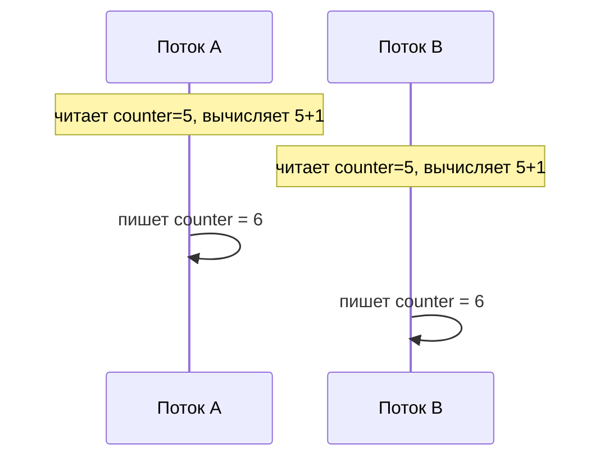
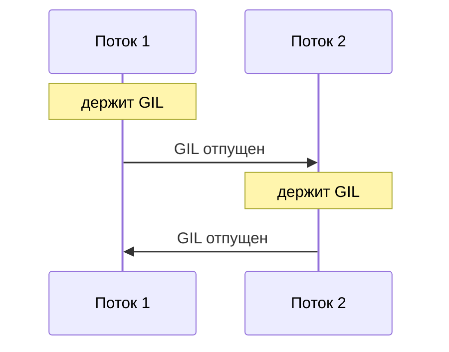

# 1.1. Управление памятью в Python

Сборщик мусора, блокировка интерпретатора, потоки

---
layout: default
---

# Зачем это знать

В Python нет `malloc`/`free` — память выделяется и освобождается сама, без
участия программиста. Из-за этого легко решить, что об управлении памятью
вообще не нужно думать.

На практике это предположение расходится с несколькими конкретными
эффектами:

<v-clicks>

- Память процесса не падает после удаления объектов и `gc.collect()`
- Объекты с циклическими ссылками не исчезают мгновенно
- `threading` в CPU-тяжёлом коде иногда работает медленнее последовательного варианта

</v-clicks>

<v-click>

У каждого эффекта есть точный механизм. Сегодняшняя лекция разбирает эти
механизмы по порядку.

</v-click>

---
layout: default
---

# План на сегодня

<v-clicks>

- Подсчёт ссылок — как Python понимает, что объект больше не нужен
- Сборщик мусора — что происходит, когда подсчёт ссылок не справляется
- Арены и пулы — откуда Python берёт память для мелких объектов
- Потоки — что это такое, зачем нужны, состояние гонки и примитивы синхронизации
- GIL — специфика именно Python поверх этой общей теории
- threading vs multiprocessing — что из этого реально ускоряет вычисления

</v-clicks>

---
layout: default
---

# Подсчёт ссылок

У каждого объекта в CPython есть счётчик — сколько мест на него ссылаются.
Присваивание переменной, передача в функцию, добавление в список или
словарь — каждое из этих действий создаёт ссылку и увеличивает счётчик
на единицу.

Это деталь реализации CPython. Другая реализация Python, например PyPy,
использует иную стратегию сборки мусора: она может не считать ссылки
вовсе и всё равно оставаться полноценным Python.

```py {monaco-run}
import sys

x = [1, 2, 3]
print(sys.getrefcount(x))  # +1 за счёт аргумента getrefcount

y = x
print(sys.getrefcount(x))  # ещё одна ссылка — счётчик вырос
```

---
layout: default
---

# Когда счётчик растёт и падает

<v-clicks>

- Растёт: присваивание (`y = x`), передача в функцию, добавление в список или словарь
- Падает: `del x`, выход переменной из области видимости, переприсваивание (`x = None`)
- Как только счётчик доходит до нуля, объект уничтожается немедленно, в этот же момент

</v-clicks>

<v-click>

Это отличает CPython от языков вроде Java, где сборщик мусора убирает
объект позже, отдельным проходом, независимо от того, когда именно
последняя ссылка на него исчезла.

</v-click>

---
layout: default
---

# Живой пример

Здесь видно рост и падение счётчика по ходу выполнения — просто подсчёт
ссылок на один и тот же объект.

```py {monaco-run}
import sys

a = [1, 2, 3]
print("после создания:", sys.getrefcount(a))

b = a
print("после b = a:", sys.getrefcount(a))

del b
print("после del b:", sys.getrefcount(a))
```

---
layout: default
---

# Где схема ломается

Подсчёт ссылок не справляется с одним случаем — циклической ссылкой,
когда два объекта ссылаются друг на друга напрямую или через цепочку
промежуточных объектов.

```python
class Node:
    def __init__(self):
        self.other = None

a = Node()
b = Node()
a.other = b
b.other = a  # цикл: a -> b -> a

del a
del b
# счётчики объектов a и b не дошли до нуля —
# они всё ещё держат друг друга через .other
```

После `del a` и `del b` снаружи на эти объекты уже никто не ссылается —
переменные исчезли. Друг на друга объекты всё ещё ссылаются, поэтому их
собственные счётчики остаются равны единице. Один подсчёт ссылок эту
память не освободит — нужен отдельный механизм.

---
layout: default
---

# `del` удаляет ссылку

Частое заблуждение: `del x` уничтожает объект. На самом деле `del`
убирает ровно одну ссылку — саму переменную `x`. Объект пропадает только
в том случае, если это была последняя ссылка на него.

```python
a = [1, 2, 3]
b = a
del a        # удалили только переменную a
print(b)     # [1, 2, 3] — объект жив, на него ссылается b
```

Именно поэтому в примере с циклом на предыдущем слайде `del a; del b` не
помогает: обе переменные исчезли, но объекты продолжают держаться друг
за друга.

---
layout: default
---

# Сборщик мусора: поколения

Чтобы находить такие циклы, Python периодически запускает отдельный
сборщик мусора поверх подсчёта ссылок. Сканировать все объекты подряд при
каждой проверке было бы дорого, поэтому объекты разбиты на поколения.

В основе — наблюдение, что большинство объектов умирают молодыми:
временные переменные и промежуточные результаты вычислений живут доли
секунды. Новые объекты проверяются часто. Те, что пережили уже несколько
проверок, статистически с большей вероятностью проживут долго, поэтому
их проверяют всё реже.


---
layout: default
---

# Когда сборщик запускается

<v-clicks>

- Автоматически — как только число новых объектов с момента прошлой проверки превышает порог (посмотреть текущие пороги можно через `gc.get_threshold()`)
- Вручную — вызовом `gc.collect()`, если память нужно освободить прямо сейчас
- Полностью отключить через `gc.disable()` — иногда так делают ради скорости в коротких скриптах

</v-clicks>

---
layout: default
---

# Найдите ошибку

```python
class Resource:
    def __init__(self, name):
        self.name = name
        self.other = None

    def __del__(self):
        print(f"{self.name}: ресурс освобождён")

a = Resource("A")
b = Resource("B")
a.other = b
b.other = a

del a
del b
print("после del — конец программы")
```

Ожидается, что при `del` в консоли появятся строки про освобождение A и B.
Их не будет. Ошибка в коде — или в ожидании?

---
layout: default
---

# Разбор

`a` и `b` образуют цикл — та же ситуация, что и раньше. Подсчёт ссылок не
может их убрать. Автоматический запуск сборщика мусора ещё не наступил к
моменту завершения программы.

```py {monaco-run}
import gc

class Resource:
    def __init__(self, name):
        self.name = name
        self.other = None
    def __del__(self):
        print(f"{self.name}: ресурс освобождён")

a = Resource("A")
b = Resource("B")
a.other = b
b.other = a
del a
del b

print("до gc.collect() — тишина")
gc.collect()
print("после gc.collect() — вот оно")
```

---
layout: default
---

# Вывод

`__del__` срабатывает в непредсказуемый момент — иногда сразу, иногда
только на следующей сборке мусора, иногда вообще при завершении процесса.
Для файлов, сетевых соединений, блокировок — всего, что нужно закрыть
вовремя, — на `__del__` полагаться нельзя.

```python
# Ненадёжно
f = open("data.txt")
# ...работа с f...
# файл закроется когда-нибудь через __del__, не факт что вовремя

# Надёжно
with open("data.txt") as f:
    ...
# закрывается гарантированно здесь же, сразу
```

`with` — единственный надёжный вариант для этого класса задач.

---
layout: default
---

# Откуда вообще берётся память

Ходить в операционную систему за памятью на каждый маленький объект —
списки из трёх элементов, короткие строки, отдельные числа — дорого:
системный вызов на порядки медленнее обычной операции внутри процесса, а
мелкие объекты в типичной Python-программе создаются миллионами.

Python делает системные вызовы редко и большими порциями, а дальше
распоряжается полученной памятью сам.

---
layout: default
---

# Три уровня


<v-clicks>

- Арена — крупный кусок памяти, который Python запрашивает у ОС редко
- Пул — арена делится на страницы поменьше, каждая — под объекты одного размера
- Блок — конкретный слот в пуле под один объект

</v-clicks>

---
layout: default
---

# Что происходит при удалении

Когда объект удаляется, его блок не возвращается операционной системе —
он помечается свободным и ждёт следующего объекта того же размера.
Переиспользование блока — работа внутри процесса, без обращения к ОС.
Это и даёт основной выигрыш в скорости.

Пул возвращает память операционной системе только тогда, когда
освобождаются все блоки в нём.

---
layout: default
---

# Практическое следствие

Диспетчер задач может показывать, что память процесса Python не
уменьшилась после `del` и `gc.collect()`. Это не обязательно утечка.

Освобождённые блоки остаются зарезервированными под конкретный размер
объекта на случай, если он снова понадобится. Потребление памяти долго
работающего Python-процесса обычно растёт до некоторого уровня и держится
там, даже если активных объектов на самом деле стало меньше.

---
layout: default
---

# Кеширование мелких объектов

Часть мелких объектов Python вообще не создаётся заново при каждом
использовании: маленькие целые числа и короткие строки кешируются и
существуют в единственном экземпляре на весь процесс.

Это отдельная оптимизация системы типов, устроенная иначе, чем арены и
пулы.

---
layout: default
---

# Что такое поток

<v-clicks>

- Процесс — запущенная программа со своей областью памяти
- Поток — отдельная линия выполнения внутри процесса
- У одного процесса может быть несколько потоков
- Все потоки одного процесса работают в одной и той же памяти: видят одни и те же переменные, объекты, открытые файлы

</v-clicks>

<v-click>

Общая память делает потоки удобными для совместной работы и одновременно
источником проблем, если ей не управлять аккуратно.

</v-click>

---
layout: default
---

# Зачем нужны потоки

Пример: программа обрабатывает сообщения от пользователей и время от
времени должна выполнить долгую операцию — скажем, обратиться к внешнему
сервису и подождать ответ. При последовательном выполнении на время
ожидания ответа программа перестаёт реагировать на новые сообщения.

Поток решает эту проблему: пока один поток ждёт ответ от сервиса, другой
продолжает принимать и обрабатывать новые сообщения.

---
layout: default
---

# Как создать поток

```python
import threading

def worker(name):
    for i in range(3):
        print(f"{name}: шаг {i}")

t1 = threading.Thread(target=worker, args=("Поток-1",))
t2 = threading.Thread(target=worker, args=("Поток-2",))

t1.start()
t2.start()
t1.join()
t2.join()
```

`Thread(target=..., args=...)` создаёт поток с указанной функцией и
аргументами для неё. После создания поток ещё не запущен: запускает его
только вызов `start()`.

---
layout: default
---

# Возможный вывод

`start()` запускает поток, `join()` ждёт его завершения перед тем, как
программа продолжит выполняться дальше.

Порядок строк ниже не гарантирован и может отличаться от запуска к
запуску:

```
Поток-1: шаг 0
Поток-2: шаг 0
Поток-1: шаг 1
Поток-2: шаг 1
Поток-1: шаг 2
Поток-2: шаг 2
```

Возможен и вариант, где весь Поток-1 отработал раньше, чем начал печатать
Поток-2. Оба варианта корректны: планировщик не гарантирует конкретное
чередование.

---
layout: default
---

# Общие ресурсы

Раз потоки работают в одной памяти, они могут читать и менять одни и те
же данные:

<v-clicks>

- Переменные и объекты в памяти процесса
- Открытые файлы
- Сетевые соединения и соединения с базой данных
- Любые структуры данных, доступные более чем одной функции

</v-clicks>

<v-click>

Общий доступ упрощает совместную работу с данными между потоками. Он же
становится источником проблем без должной координации.

</v-click>

---
layout: default
---

# Состояние гонки

Race condition — ситуация, когда результат работы программы зависит от
порядка и момента выполнения операций разных потоков. Общая проблема
многопоточности, не специфичная для конкретного языка.



---
layout: default
---

# Что это значит

Оба потока прочитали одно и то же старое значение `counter = 5` до того,
как кто-то из них его обновил. Итог — 6, хотя инкрементов было два, а
правильный результат — 7: одно обновление потерялось безвозвратно.

Код на каждом потоке по отдельности корректен. Проблема возникает на
стыке, когда несколько потоков трогают одни и те же данные без
координации.

---
layout: default
---

# Lock — базовая блокировка

Простейшее решение — блокировка (lock, мьютекс). Участок кода, работающий
с общими данными, помечается как критическая секция: одновременно в неё
может зайти только один поток, остальные ждут своей очереди.

```python
import threading

counter = 0
lock = threading.Lock()

def increment():
    global counter
    with lock:
        counter += 1  # теперь только один поток одновременно
```

Идея платформенно-независимая: блокировки в этом же смысле существуют в
Java, C++, Go — везде, где есть потоки и общая память.

---
layout: default
---

# RLock — реентерабельная блокировка

Обычный `Lock` нельзя захватить дважды из одного и того же потока: вторая
попытка приведёт к вечному ожиданию, даже если это тот же поток. Это
становится проблемой для рекурсивных функций и методов, вызывающих друг
друга внутри одного объекта.

```python
lock = threading.RLock()

def outer():
    with lock:
        inner()   # тот же поток снова берёт тот же лок

def inner():
    with lock:
        ...       # с обычным Lock здесь было бы вечное ожидание
```

`RLock` запоминает, какой поток его держит, и считает число захватов.
Освобождать нужно столько же раз, сколько раз захватывали.

---
layout: default
---

# Semaphore — ограничение количества

`Lock` пускает в критическую секцию ровно один поток. `Semaphore`
обобщает эту идею: хранит счётчик и пускает внутрь до N потоков
одновременно.

```python
# не больше 3 потоков одновременно обращаются к ресурсу
semaphore = threading.Semaphore(3)

def access_resource():
    with semaphore:
        ...   # здесь одновременно не больше 3 потоков
```

Типичное применение — ограничение числа одновременных подключений к базе
данных или внешнему сервису: система не пускает больше запросов, чем
способна выдержать одновременно.

---
layout: default
---

# Event — сигнал о событии

`Event` — флаг с двумя состояниями. Один поток может его установить,
остальные — ждать, пока это произойдёт.

```python
ready = threading.Event()

def worker():
    print("жду сигнала")
    ready.wait()   # блокируется, пока флаг не установят
    print("сигнал получен, продолжаю")

def main_thread():
    ...             # какая-то подготовка
    ready.set()     # разблокирует всех, кто ждёт на wait()
```

Применяется, когда один поток должен дождаться завершения инициализации
или подготовки данных в другом потоке.

---
layout: default
---

# Condition и Barrier

`Condition` объединяет lock с ожиданием условия: поток отпускает
блокировку и засыпает до тех пор, пока другой поток не оповестит его
через `notify()`. Классический способ реализовать очередь
«производитель — потребитель».

`Barrier` — точка встречи для заранее известного числа потоков: каждый,
кто доходит до барьера, останавливается и ждёт остальных. Когда все N
потоков дошли до этой точки, все они продолжают выполнение одновременно.

```python
barrier = threading.Barrier(3)

def worker():
    ...             # подготовительная работа
    barrier.wait()  # ждём, пока все 3 потока не дойдут сюда
    ...             # дальше все стартуют одновременно
```

---
layout: center
---

# Но в Python есть особенность

Всё, что было выше — общая теория, верная для потоков в любом языке.
В Python поверх неё есть ещё один механизм — GIL.

---
layout: default
---

# GIL: что это буквально

GIL — Global Interpreter Lock, глобальная блокировка интерпретатора. В
один момент времени байткод Python исполняет только один поток, даже
если в процессе их запущено десять.

В отличие от `Lock` или `Semaphore`, GIL не создаётся и не настраивается
программистом: он встроен в сам интерпретатор CPython и действует всегда,
независимо от того, использует ли код свои собственные примитивы
синхронизации.

---
layout: default
---

# Кто по очереди



Переключение происходит по времени (обычно доли миллисекунды) или когда
поток сам отдаёт управление — например, на операции ввода-вывода.

---
layout: default
---

# Зачем он нужен

Причина — тот же подсчёт ссылок из начала лекции. Если бы два потока
одновременно меняли счётчик ссылок одного объекта, значение могло бы
посчитаться неверно: тот же race condition, что и с обычным счётчиком,
только на уровне внутренних структур самого интерпретатора.

GIL решает эту конкретную проблему грубым, но надёжным способом: не
пускает потоки исполнять байткод параллельно, так что до внутренних
счётчиков ссылок гонка не добирается.

---
layout: default
---

# Чего GIL не блокирует

<v-clicks>

- Файловый и сетевой ввод-вывод — поток отдаёт GIL на время ожидания, другие потоки в это время работают
- C-расширения вроде numpy — многие из них явно отпускают GIL на время тяжёлых вычислений в C-коде
- Потоки операционной системы как таковые: они создаются по-настоящему, ограничение именно на одновременное исполнение байткода Python

</v-clicks>

---
layout: center
---

# Заблуждение

«В Python нет настоящей многопоточности» — неточно.

Потоки операционной системы создаются по-настоящему, `threading.Thread` —
не эмуляция. Ограничение конкретнее: одновременно байткод Python исполняет
только один из них.

---
layout: default
---

# Когда это важно, а когда нет

<v-clicks>

- CPU-bound задача упирается в вычисления (математика, обработка данных в цикле). GIL мешает напрямую: потоки не ускоряют такую работу
- IO-bound задача упирается в ожидание (сеть, диск, база данных). GIL почти не мешает: пока один поток ждёт ответа, GIL свободен для остальных

</v-clicks>

<v-click>

Программа, которая продолжает принимать сообщения, пока ждёт ответ от
внешнего сервиса, — это IO-bound случай: GIL там не мешает.

</v-click>

---
layout: default
---

# Найдите ошибку

```python
import threading

counter = 0

def increment():
    global counter
    for _ in range(500_000):
        counter += 1

threads = [threading.Thread(target=increment) for _ in range(16)]
for t in threads:
    t.start()
for t in threads:
    t.join()

assert counter == 16 * 500_000
```

Та же общая проблема, что и с race condition выше. GIL гарантирует, что
байткод исполняет только один поток одновременно. Значит ли это, что этот
код потокобезопасен?

---
layout: default
---

# Разбор

<v-clicks>

- `counter += 1` — это минимум три отдельные операции: прочитать значение, прибавить единицу, записать обратно
- GIL гарантирует атомарность одного байткод-шага. Всю последовательность из трёх шагов целиком он не защищает
- Поток может быть прерван между чтением и записью — тогда чужой инкремент потеряется, тот же механизм, что и в общем случае с потоками A и B

</v-clicks>

---
layout: default
---

# А что на практике

Реальный прогон именно этого кода (16 потоков, по 500 000 инкрементов) —
четыре раза подряд.

```
Ожидали: 8000000, получили: 8000000, разница: 0
Ожидали: 8000000, получили: 8000000, разница: 0
Ожидали: 8000000, получили: 8000000, разница: 0
Ожидали: 8000000, получили: 8000000, разница: 0
```

Счётчик сошёлся точно все четыре раза. Это везение: `+=` выполняется
быстро, окно для перехвата между чтением и записью очень маленькое.
Совпадающий результат теста ничего не говорит о безопасности кода как
такового.

---
layout: default
---

# Расширяем окно

Если явно развести чтение и запись во времени, гонка перестаёт быть делом
случая:

```python
def increment():
    global counter
    for _ in range(1_000):
        current = counter
        time.sleep(0)          # гарантированная точка переключения
        counter = current + 1
```

Реальный результат: `Ожидали: 4000, получили: 1281, разница: 2789` — и
так каждый раз. Механизм тот же самый, что и в `+=`: окно между чтением и
записью теперь достаточно большое, чтобы гонка происходила каждый раз.

---
layout: default
---

# Итог по GIL

Прошедший сто раз подряд тест ничего не говорит о безопасности кода при
параллельном доступе — гонка могла просто не проявиться за эти сто
попыток.

GIL защищает только внутренние структуры самого интерпретатора. Данные
программиста он не защищает: для них по-прежнему нужны `Lock`,
`Semaphore` и другие примитивы синхронизации.

---
layout: center
---

# Бонус: Python без GIL

GIL перестаёт быть обязательным. PEP 703 добавил сборку CPython без GIL,
PEP 779 в 2025 году сделал её официально поддерживаемой (не
экспериментальной) начиная с Python 3.14 — под отдельным тегом `3.14t`.

Сборкой по умолчанию она пока не стала: переключение запланировано на
несколько лет вперёд. Однопоточный код в такой сборке медленнее на
5–10%, зато CPU-bound многопоточный код может ускоряться в разы — без
multiprocessing и без сериализации данных между процессами.

---
layout: two-cols
---

# threading

- Несколько потоков в одном процессе
- Общая память — легко делиться данными
- Старт лёгкий и быстрый
- Ограничены GIL на уровне байткода

::right::

# multiprocessing

- Несколько отдельных процессов
- У каждого — своя память, свой интерпретатор, свой GIL
- Старт дороже, данные передаются через сериализацию
- Реальный параллелизм на разных ядрах

---
layout: default
---

# Цена multiprocessing

Параллелизм не бесплатный:

<v-clicks>

- Старт процесса ощутимо дороже старта потока — операционной системе нужно создать полноценную копию окружения, это единицы-десятки миллисекунд против долей миллисекунды на поток
- Процессы не делят память напрямую: данные между ними передаются через сериализацию (`pickle`)
- Multiprocessing имеет смысл для задач, которые считают заметно дольше, чем длится сама передача данных

</v-clicks>

---
layout: default
---

# Как создать процесс

Синтаксис почти дословно повторяет `threading`. Это осознанное решение
авторов модуля.

```python
import multiprocessing

def worker(name):
    for i in range(3):
        print(f"{name}: шаг {i}")

if __name__ == "__main__":
    p1 = multiprocessing.Process(target=worker, args=("Процесс-1",))
    p2 = multiprocessing.Process(target=worker, args=("Процесс-2",))
    p1.start()
    p2.start()
    p1.join()
    p2.join()
```

`if __name__ == "__main__":` здесь обязательное требование: на некоторых
платформах дочерний процесс повторно импортирует основной файл, и без
этой проверки он начал бы рекурсивно запускать новые процессы.

---
layout: default
---

# Память не общая

Главное отличие от потоков видно на этом примере: дочерний процесс меняет
переменную, а родительский процесс об этом изменении не узнаёт.

```python
import multiprocessing

counter = 0

def bump():
    global counter
    counter += 100
    print(f"Внутри процесса: counter = {counter}")

if __name__ == "__main__":
    p = multiprocessing.Process(target=bump)
    p.start()
    p.join()
    print(f"В родительском процессе: counter = {counter}")
```

---
layout: default
---

# Что это доказывает

Реальный вывод предыдущего примера:

```
Внутри процесса: counter = 100
В родительском процессе: counter = 0
```

У процесса своя копия памяти, полученная в момент создания. Чтобы вернуть
результат работы в родительский процесс, его нужно явно передать —
например, через `multiprocessing.Queue`

---
layout: default
---

# Реальный замер: число π методом Монте-Карло

Первая проверка шла на
машине с одним ядром CPU — там multiprocessing физически не может
ускориться, ядру негде выполнять что-то параллельно. Правый столбец —
 цифры для четырёх ядер, полученные измерением.

| Способ | 1 ядро | 4 ядра |
|---|---|---|
| Последовательно | 2.47 с | ≈2.47 с |
| threading (4 потока) | 2.57 с | ≈2.56 с |
| multiprocessing (4 процесса) | 2.57 с | ≈0.7–0.8 с |

threading не ускоряется независимо от числа ядер. Причина — GIL, и это
видно уже на одном ядре. Multiprocessing на одном ядре ускориться не
может физически; на нескольких ядрах ускорение обычно близко к их числу.

---
layout: default
---

# Почему threading не помог

<v-clicks>

- Все 4 потока по очереди ждут доступа к GIL для каждой операции внутри цикла
- Переключение между потоками само по себе стоит времени — нужно сохранить состояние одного и восстановить состояние другого
- Параллельного выигрыша это не даёт, поэтому итог иногда получается даже медленнее последовательной версии

</v-clicks>

---
layout: default
---

# А если бы задача была IO-bound

Если бы вместо вычислений потоки ждали ответа по сети — например, 4
запроса к внешнему API — картина была бы обратной: threading дал бы почти
четырёхкратное ускорение, потому что во время ожидания GIL свободен для
остальных потоков.

---
layout: default
---

# Как выбирать

<v-clicks>

- Задача CPU-bound → `multiprocessing`
- Задача IO-bound → `threading`, либо `asyncio`

</v-clicks>

---
layout: default
---

# Конспект: управление памятью

| Механизм | Что делает | Когда важно |
|---|---|---|
| Подсчёт ссылок | Уничтожает объект, когда счётчик = 0 | Всегда, автоматически |
| Сборщик мусора | Находит циклы, которые подсчёт ссылок не видит | Циклические структуры данных |
| Арены / пулы / блоки | Переиспользуют память мелких объектов без обращений к ОС | Память процесса не падает после `del` — это нормально |

---
layout: default
---

# Конспект: потоки и параллелизм

| Механизм | Что делает | Когда важно |
|---|---|---|
| Race condition / примитивы синхронизации | Общие данные без координации дают непредсказуемый результат | Любой многопоточный код с общими данными, в любом языке |
| GIL | Один поток исполняет байткод Python в любой момент | Общие данные всё равно нужно защищать `Lock`/`Semaphore` |
| threading vs multiprocessing | Потоки — общая память, процессы — параллелизм на ядрах | CPU-bound → процессы, IO-bound → потоки |

---
layout: default
---

# Найдите ошибку

```python
import threading, time
lock_a, lock_b = threading.Lock(), threading.Lock()

def worker1():
    with lock_a:
        print("worker1: A есть, нужен B")
        time.sleep(0.2)
        with lock_b:
            print("worker1: получил B")

def worker2():
    with lock_b:
        print("worker2: B есть, нужен A")
        time.sleep(0.2)
        with lock_a:
            print("worker2: получил A")

t1 = threading.Thread(target=worker1)
t2 = threading.Thread(target=worker2)
t1.start(); t2.start()
t1.join(); t2.join()
print("готово")
```

Что произойдёт при запуске?

---
layout: default
---

# Разбор

Реальный вывод при запуске:

```
worker1: A есть, нужен B
worker2: B есть, нужен A
```

Строка `"готово"` не появится: программа зависает. `worker1` держит
`lock_a` и ждёт `lock_b`. `worker2` держит `lock_b` и ждёт `lock_a`. Оба
ждут друг друга бесконечно — это deadlock, взаимная блокировка.

Классическое решение — захватывать блокировки в одном и том же порядке
во всех потоках. Если бы `worker2` тоже сначала брал `lock_a`, а потом
`lock_b`, встречного порядка захвата просто не возникло бы.


---
layout: center
---
<script setup>
import VueQrcode from 'vue-qrcode'
</script>
# Самостоятельно

[LeetCode 1114. Print in Order](https://leetcode.com/problems/print-in-order/)
<VueQrcode value="https://leetcode.com/problems/print-in-order/" :options="{ width: 250 }" class="mx-auto my-6 rounded-lg" />
Задача на то же, что было в этой лекции: заставить три потока выполниться
в строго заданном порядке с помощью примитивов синхронизации.

---
layout: end
---

# Вопросы