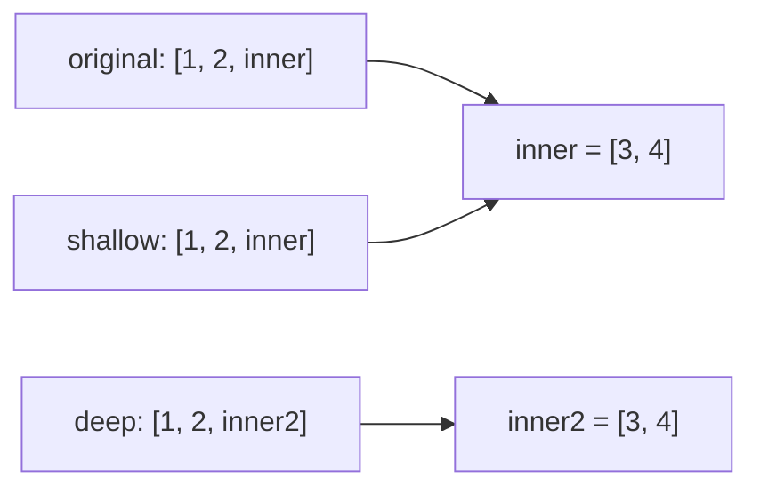

# 1.2. Система типов

Изменяемые и неизменяемые объекты. Dataclasses

---
layout: default
---

# Зачем это знать

```python
a = [1, 2, 3]
b = a
b.append(4)
print(a)  # [1, 2, 3, 4] — a тоже изменился
```

`a = b` выглядит как копирование значения. На самом деле копируется
ссылка на объект. Для одних типов это создаёт подобные
неожиданности, для других — нет. Эта разница определяет поведение
хеш-таблиц, аргументов по умолчанию и части стандартной библиотеки Python.

---
layout: default
---

# План на сегодня

<v-clicks>

- Изменяемые и неизменяемые типы — что это значит на практике
- Присваивание, копирование, идентичность
- Классическая ловушка — изменяемый аргумент по умолчанию
- Интернирование — как Python экономит память на повторяющихся значениях
- dataclasses — готовые классы-контейнеры без шаблонного кода

</v-clicks>

---
layout: default
---

# Что значит «изменяемый» объект

Изменяемый (mutable) объект можно поменять после создания, не создавая
новый: добавить элемент, поменять значение по индексу, обновить поле.
Неизменяемый (immutable) объект после создания менять нельзя — любая
операция, которая выглядит как изменение, на самом деле создаёт новый
объект.

```py {monaco-run}
lst = [1, 2, 3]
print(id(lst))
lst.append(4)
print(id(lst))   # тот же id — объект изменился на месте

s = "abc"
print(id(s))
s = s + "d"
print(id(s))      # другой id — создан новый объект
```

---
layout: default
---

# Изменяемые типы

<v-clicks>

- `list` — список
- `dict` — словарь
- `set` — множество
- Пользовательские классы по умолчанию (если явно не сделать их неизменяемыми)

</v-clicks>

---
layout: default
---

# Неизменяемые типы

<v-clicks>

- `int`, `float`, `bool` — числа
- `str` — строка
- `tuple` — кортеж
- `frozenset` — неизменяемое множество

</v-clicks>

---
layout: default
---

# Зачем это различие важно

Словарь и множество не перебирают все элементы при поиске — они вычисляют
число (хеш) от ключа и по этому числу сразу находят нужную ячейку.
Именно поэтому ключом словаря или элементом множества может быть только
неизменяемый объект.

Хеш ключа вычисляется один раз при добавлении и должен оставаться верным
всё время, пока объект лежит в структуре. Если бы объект мог измениться
после этого, его хеш перестал бы совпадать с текущим содержимым, и поиск
перестал бы находить нужный элемент.

---
layout: default
---

# Живая проверка

```py {monaco-run}
d = {}
try:
    d[[1, 2]] = "значение"
except TypeError as e:
    print("TypeError:", e)

d[(1, 2)] = "значение"
print(d)
```

<v-click>

Список нельзя использовать как ключ — он изменяемый. Кортеж с теми же
элементами подходит.

</v-click>

---
layout: default
---

# Присваивание — не копирование

```py {monaco-run}
a = [1, 2, 3]
b = a
print(a is b)      # True — это один и тот же объект

b.append(4)
print(a)            # [1, 2, 3, 4]
```

<v-click>

`b = a` создаёт вторую ссылку на тот же объект в памяти. Копия при этом не создаётся.
Изменение через любую из ссылок видно через обе.

</v-click>

---
layout: default
---

# То же самое для неизменяемых

```py {monaco-run}
a = "hello"
b = a
print(a is b)   # True — тоже одна и та же строка

b = b + " world"
print(a, b)       # a не изменился
print(a is b)      # False — b теперь другой объект
```

<v-click>

Механизм присваивания одинаковый для любых типов. Разница в том, что у
неизменяемых объектов операция `b + " world"` не может поменять
существующий объект — она обязана создать новый.

</v-click>

---
layout: default
---

# Передача в функцию

```py {monaco-run}
def add_item(lst):
    lst.append("новый")

data = ["a", "b"]
add_item(data)
print(data)   # ["a", "b", "новый"] — функция изменила исходный список
```

<v-click>

Аргумент внутри функции — новая ссылка на тот же объект, не копия. Для
изменяемых объектов это означает, что функция может поменять данные
вызывающего кода, даже не возвращая ничего явно.

</v-click>

---
layout: default
---

# Найдите ошибку

```python
def add_student(name, roster=[]):
    roster.append(name)
    return roster

group_a = add_student("Аня")
group_b = add_student("Борис")

print(group_a)
print(group_b)
```

Ожидается, что `group_a` и `group_b` — два разных списка по одному имени
в каждом. На практике это не так. Что происходит?

---
layout: default
---

# Разбор

Значение по умолчанию для аргумента вычисляется один раз — в момент
определения функции. При каждом вызове оно не пересчитывается. Список `[]` создаётся один
раз и используется как один и тот же объект во всех вызовах, где
аргумент не передан явно.

`group_a` и `group_b` оказываются ссылками на один и тот же список,
который к моменту второго вызова уже содержит "Аня".

---
layout: default
---

# Доказательство

```py {monaco-run}
def f(lst=[]):
    return lst

first_call = id(f())
second_call = id(f())
print(first_call == second_call)   # True — один и тот же объект
```

<v-click>

`id()` возвращает одинаковое значение при обоих вызовах — это буквально
один объект в памяти, не два одинаковых списка.

</v-click>

---
layout: default
---

# Как чинить

```python
def add_student(name, roster=None):
    if roster is None:
        roster = []
    roster.append(name)
    return roster
```

`None` — сентинел: значение по умолчанию, которое не участвует в логике
самой функции, а лишь сигнализирует «аргумент не передан». Новый список
создаётся внутри функции при каждом вызове, где `roster` не указан.

---
layout: default
---

# Неполная неизменяемость

Кортеж — неизменяемый тип, но это относится только к самому кортежу как
контейнеру: нельзя поменять, какой объект лежит на каждой позиции. Если
на этой позиции лежит изменяемый объект, его содержимое менять можно.

```py {monaco-run}
t = (1, 2, [3, 4])
try:
    t[0] = 99
except TypeError as e:
    print("TypeError:", e)

t[2].append(5)
print(t)   # (1, 2, [3, 4, 5]) — кортеж "не менялся", а его содержимое — да
```

---
layout: default
---

# Поверхностное копирование

```py {monaco-run}
import copy

original = [1, 2, [3, 4]]
shallow = copy.copy(original)

print(original is shallow)              # False — новый список
print(original[2] is shallow[2])        # True — вложенный список общий

shallow[2].append(5)
print(original)   # [1, 2, [3, 4, 5]] — изменился и оригинал
```

<v-click>

`copy.copy()` создаёт новый объект верхнего уровня, но не копирует
вложенные объекты — они остаются общими.

</v-click>

---
layout: default
---

# Глубокое копирование

```py {monaco-run}
import copy

original = [1, 2, [3, 4]]
deep = copy.deepcopy(original)

print(original[2] is deep[2])   # False — независимая копия вложенного списка

deep[2].append(5)
print(original)   # [1, 2, [3, 4]] — оригинал не тронут
print(deep)        # [1, 2, [3, 4, 5]]
```

<v-click>

`copy.deepcopy()` рекурсивно копирует все вложенные объекты, включая
все уровни вложенности.

</v-click>

---
layout: default
---

# Shallow vs deep копирование



`shallow` — отдельный список, но его третий элемент — тот же объект
`inner`, что и у оригинала. `deep` получает собственную независимую копию
вложенного списка.

---
layout: default
---

# `id()`, `is` и `==`

```py {monaco-run}
a = [1, 2, 3]
b = [1, 2, 3]
c = a

print(a == b)   # True — одинаковое содержимое
print(a is b)   # False — разные объекты в памяти
print(a is c)   # True — один и тот же объект

print(id(a), id(b), id(c))
```

<v-click>

`==` сравнивает значения (для списка — содержимое поэлементно). `is`
сравнивает идентичность — один ли это объект в памяти. `id()` возвращает
число, по которому эта идентичность проверяется.

</v-click>

---
layout: default
---

# Когда `is` и `==` совпадают

| Ситуация | `==` | `is` |
|---|---|---|
| Два списка с одинаковым содержимым | `True` | `False` |
| Маленькое целое число (кешируется) | `True` | `True` |
| Большое целое число, два раза вычислено отдельно | `True` | обычно `False` |
| Одна и та же переменная под двумя именами | `True` | `True` |
| `None` | `True` (`is None` — стандартный способ) | `True` |

Проверять равенство значений следует через `==`. `is` предназначен для
проверки идентичности объекта. Исключение — `None`: `is None` считается принятой практикой.

---
layout: default
---

# Наивная проверка малых чисел

```py {monaco-run}
print(-5 is -5)
print(256 is 256)
print(257 is 257)
print(-6 is -6)
```

<v-click>

Все четыре строки печатают `True`. Похоже, что кешируются вообще любые
целые числа — это противоречит распространённому утверждению про диапазон
от -5 до 256.

</v-click>

---
layout: default
---

# Почему наивный тест обманывает

Каждая строка вида `257 is 257` — это одно выражение с двумя одинаковыми
литералами. Компилятор Python сворачивает повторяющиеся константы внутри
одного блока кода в один и тот же объект ещё на этапе компиляции, до
всякого исполнения. Тест проверяет не кеш чисел, а оптимизацию
компилятора.

Чтобы увидеть реальное поведение кеша, значения нужно получить не из
литералов, а вычислить в рантайме — так, чтобы компилятор не мог заранее
свернуть их в одну константу.

---
layout: default
---

# Настоящая проверка

```py {monaco-run}
def compute(n):
    total = 0
    for _ in range(n):
        total += 1
    return total

print(compute(256) is compute(256))   # True
print(compute(257) is compute(257))   # False
```

<v-click>

Значение, вычисленное циклом, компилятор заранее свернуть не может — это
честная проверка. Результат другой: 256 всё ещё кешируется, 257 — уже
нет.

</v-click>

---
layout: default
---

# Реальная граница кеша

CPython создаёт при старте интерпретатора готовые объекты для целых чисел
от -5 до 256 включительно и переиспользует их вместо создания новых. Это
диапазон значений, которые статистически чаще всего встречаются в
обычном коде: индексы, небольшие счётчики, коды состояний.

За пределами этого диапазона каждое вычисленное число — отдельный объект,
даже если значение совпадает.

---
layout: default
---

# Интернирование строк

```py {monaco-run}
a = "hello"
b = "hello"
print(a is b)   # True

c = "hello world"
d = "hello world"
print(c is d)   # True — тоже совпадают
```

<v-click>

Строковые литералы, похожие на идентификаторы, интернируются — Python
хранит один экземпляр строки и переиспользует его для одинаковых
литералов.

</v-click>

---
layout: default
---

# Строка, построенная в рантайме

```py {monaco-run}
part = "hel"
runtime_built = part + "lo"

print(runtime_built == "hello")   # True — содержимое совпадает
print(runtime_built is "hello")   # False — интернирования не было
```

<v-click>

Строка, собранная во время выполнения из переменных, автоматически не
интернируется. Тот же механизм, что и с числами: интернирование —
оптимизация для того, что компилятор видит как константу заранее.
Произвольные рантайм-вычисления под неё не подпадают.

</v-click>

---
layout: default
---

# `sys.intern()`

```py {monaco-run}
import sys

part = "hel"
runtime_built = part + "lo"
forced = sys.intern(runtime_built)

print(forced is "hello")   # True — теперь та же строка
```

<v-click>

`sys.intern()` явно просит интерпретатор зарегистрировать строку в
таблице интернированных и вернуть на неё ссылку — если такая строка там
уже есть, вернётся именно она.

</v-click>

---
layout: default
---

# Зачем это нужно

<v-clicks>

- Память — одна копия часто повторяющегося значения вместо множества одинаковых
- Скорость сравнения — сравнение `is` для интернированных строк работает за одну проверку адреса, без посимвольного сравнения
- Ключи словарей и атрибуты объектов в CPython интернируются автоматически именно по этой причине

</v-clicks>

---
layout: default
---

# Практический вывод

`is` не предназначен для сравнения значений. Интернирование и кеширование
малых чисел — детали реализации CPython. Языковой гарантии на этот счёт
нет, и в коде, где важна корректность, полагаться на них нельзя. Для сравнения значений
всегда используется `==`, `is` — только для проверки идентичности
объекта.

---
layout: default
---

# Напоминание: три метода класса

<v-clicks>

- `__init__` — вызывается автоматически при создании объекта (`Point(1, 2)`), задаёт начальные значения атрибутов
- `__repr__` — определяет, что покажет `print()` или `repr()` для этого объекта
- `__eq__` — определяет, что делает `==` при сравнении двух объектов

</v-clicks>

<v-click>

Если `__eq__` не определён явно, `==` для обычного класса сравнивает
объекты по identity — так же, как `is` в начале лекции. Два объекта с
одинаковыми полями будут считаться неравными, если это разные экземпляры.

</v-click>

---
layout: default
---

# Проблема

Класс-контейнер для данных — частая задача: описать структуру и получить
разумные `__init__`, вывод на печать, сравнение. Вручную это выглядит так:

```python
class Point:
    def __init__(self, x, y):
        self.x = x
        self.y = y

    def __repr__(self):
        return f"Point(x={self.x}, y={self.y})"

    def __eq__(self, other):
        if not isinstance(other, Point):
            return NotImplemented
        return (self.x, self.y) == (other.x, other.y)
```

Три метода ради двух полей — и это без сравнения по порядку, без
неизменяемости, без валидации.

---
layout: default
---

# `@dataclass`

```py {monaco-run}
from dataclasses import dataclass

@dataclass
class Point:
    x: int
    y: int

p1 = Point(1, 2)
p2 = Point(1, 2)
print(p1)          # Point(x=1, y=2)
print(p1 == p2)    # True
```

<v-click>

Тот же результат — четыре строки вместо пятнадцати.

</v-click>

---
layout: default
---

# Что генерируется автоматически

<v-clicks>

- `__init__` — конструктор по перечисленным полям
- `__repr__` — читаемое строковое представление для отладки
- `__eq__` — сравнение по значениям всех полей

</v-clicks>

<v-click>

`__hash__` не генерируется по умолчанию — обычный dataclass изменяем, а
значит, по той же логике, что и в начале лекции, не должен быть
хешируемым.

</v-click>

---
layout: default
---

# Аннотации обязательны

```python
@dataclass
class Point:
    x: int
    y: int
```

Аннотация `x: int` не проверяется в рантайме — передать строку вместо
числа всё равно можно, dataclass это не остановит. Аннотация нужна
исключительно механизму dataclass, чтобы понять, какие атрибуты класса
считать полями. Без аннотации атрибут в генерируемый `__init__` не
попадёт.

---
layout: default
---

# Значения по умолчанию

```python
@dataclass
class Config:
    debug: bool = False
    max_retries: int = 3
    name: str = "default"

c = Config()
print(c)   # Config(debug=False, max_retries=3, name='default')
```

Для неизменяемых типов значение по умолчанию указывается напрямую — как в
обычной функции.

---
layout: default
---

# Изменяемое значение по умолчанию

```py {monaco-run}
from dataclasses import dataclass

try:
    @dataclass
    class Bad:
        items: list = []
except ValueError as e:
    print("ValueError:", e)
```

<v-click>

dataclass отказывается создавать класс с изменяемым значением по
умолчанию прямо на этапе определения.

</v-click>

---
layout: default
---

# Почему это ловится раньше

Причина та же самая, что и с обычной функцией в начале лекции: значение
по умолчанию вычисляется один раз, и все экземпляры класса делили бы один
и тот же список. Разница в реакции: обычная функция создаёт такой список
молча, ошибка обнаруживается только при использовании. dataclass
проверяет типы известных изменяемых значений (`list`, `dict`, `set`) при
определении класса и останавливает выполнение сразу, до создания хотя бы
одного экземпляра.

---
layout: default
---

# `field(default_factory=...)`

Правильный способ задать изменяемое значение по умолчанию — не значение
напрямую, а функция, которая создаёт новое значение при каждом вызове.

```python
from dataclasses import dataclass, field

@dataclass
class Good:
    items: list = field(default_factory=list)
```

`default_factory` принимает любую функцию без аргументов: `list`, `dict`,
`set` или собственную функцию.

---
layout: default
---

# `default_factory` в действии

```py {monaco-run}
from dataclasses import dataclass, field

@dataclass
class Good:
    items: list = field(default_factory=list)

a = Good()
b = Good()
a.items.append(1)

print(a.items, b.items)
print(a.items is b.items)   # False — разные списки
```

<v-click>

У каждого экземпляра теперь собственный список — не общий на весь класс.

</v-click>

---
layout: default
---

# `field(repr=False)`

```py {monaco-run}
from dataclasses import dataclass, field

@dataclass
class User:
    name: str
    password: str = field(repr=False)

u = User("nikita", "secret123")
print(u)   # User(name='nikita') — password не попал в вывод
```

<v-click>

Поле участвует в конструкторе и сравнении как обычно, но скрыто из
автоматического `__repr__` — удобно для паролей и токенов.

</v-click>

---
layout: default
---

# `field(compare=False)`

```py {monaco-run}
from dataclasses import dataclass, field

@dataclass
class Point:
    x: int
    y: int
    label: str = field(default="", compare=False)

print(Point(1, 2, "a") == Point(1, 2, "b"))   # True
```

<v-click>

Поле `label` участвует в конструкторе и в выводе, но не учитывается при
сравнении на равенство — сравниваются только `x` и `y`.

</v-click>

---
layout: default
---

# `field(init=False)`

```python
from dataclasses import dataclass, field

@dataclass
class Circle:
    radius: float
    area: float = field(init=False)
```

Поле не принимается конструктором — его нельзя передать при создании
объекта напрямую. Такие поля обычно вычисляются внутри `__post_init__`,
о котором дальше.

---
layout: default
---

# `__post_init__`

dataclass вызывает метод `__post_init__` сразу после автоматически
сгенерированного `__init__`, если такой метод определён в классе. Два
типичных применения: вычислить поле на основе остальных или проверить
переданные значения.

---
layout: default
---

# `__post_init__`: вычисляемое поле

```py {monaco-run}
from dataclasses import dataclass, field

@dataclass
class Rectangle:
    width: float
    height: float
    area: float = field(init=False)

    def __post_init__(self):
        self.area = self.width * self.height

r = Rectangle(3, 4)
print(r)   # Rectangle(width=3, height=4, area=12)
```

<v-click>

`area` вычисляется автоматически при создании объекта — передавать его
явно нельзя, поле объявлено с `init=False`.

</v-click>

---
layout: default
---

# `__post_init__`: валидация

```py {monaco-run}
from dataclasses import dataclass

@dataclass
class Age:
    value: int
    def __post_init__(self):
        if self.value < 0:
            raise ValueError("возраст не может быть отрицательным")

try:
    Age(-5)
except ValueError as e:
    print("ValueError:", e)
```

<v-click>

Конструктор dataclass не проверяет значения сам — вся логика валидации
пишется в `__post_init__` вручную, как в обычном классе.

</v-click>

---
layout: default
---

# `frozen=True`

```python
@dataclass(frozen=True)
class Immutable:
    x: int
```

Экземпляр становится неизменяемым: попытка присвоить значение атрибуту
после создания вызывает исключение. Все поля по-прежнему задаются один
раз — в конструкторе.

---
layout: default
---

# `frozen=True` в действии

```py {monaco-run}
from dataclasses import dataclass

@dataclass(frozen=True)
class Immutable:
    x: int

obj = Immutable(5)
try:
    obj.x = 10
except Exception as e:
    print(type(e).__name__, "—", e)
```

<v-click>

`FrozenInstanceError` — специальный подкласс `AttributeError`, привязанный
именно к dataclass.

</v-click>

---
layout: default
---

# Связь с началом лекции

В начале лекции неизменяемость связывалась с хешируемостью: изменяемый
объект нельзя использовать как ключ словаря, потому что его хеш не может
оставаться постоянным. `frozen=True` замыкает эту цепочку: помимо запрета
на изменение атрибутов, dataclass с `frozen=True` (при включённом по
умолчанию сравнении) автоматически получает `__hash__` — то, чего у
обычного dataclass нет.

---
layout: default
---

# Хешируемый dataclass

```py {monaco-run}
from dataclasses import dataclass

@dataclass(frozen=True)
class Point:
    x: int
    y: int

points = {Point(1, 2), Point(1, 2), Point(3, 4)}
print(len(points))   # 2 — одинаковые по значению схлопнулись

lookup = {Point(1, 2): "начало координат"}
print(lookup[Point(1, 2)])
```

<v-click>

Экземпляр `frozen`-dataclass теперь можно класть в `set` и использовать
как ключ словаря — то, что было недоступно обычному изменяемому классу.

</v-click>

---
layout: default
---

# Порядок полей

Поле без значения по умолчанию не может идти после поля со значением по
умолчанию — иначе непонятно, какое значение подставлять при позиционном
вызове конструктора. Это то же правило, что действует для обычных функций
Python, dataclass его не меняет, а наследует напрямую.

```python
@dataclass
class Bad:
    a: int = 1
    b: int          # поле без default после поля с default
```

---
layout: default
---

# Реальная ошибка

```py {monaco-run}
from dataclasses import dataclass

try:
    exec("""
@dataclass
class Bad:
    a: int = 1
    b: int
""")
except TypeError as e:
    print("TypeError:", e)
```

<v-click>

Ошибка возникает на этапе определения класса, до создания любого
экземпляра — так же, как и с изменяемым значением по умолчанию.

</v-click>

---
layout: default
---

# `order=True`

```python
@dataclass(order=True)
class Card:
    rank: int
    suit: str
```

По умолчанию dataclass даёт только `==` и `!=`. С `order=True`
добавляются `<`, `<=`, `>`, `>=` — сравнение идёт по полям слева направо,
как при сравнении кортежей.

---
layout: default
---

# `order=True` в действии

```py {monaco-run}
from dataclasses import dataclass

@dataclass(order=True)
class Card:
    rank: int
    suit: str

cards = [Card(5, "s"), Card(2, "h"), Card(9, "d")]
print(sorted(cards))
```

<v-click>

`sorted()` сравнивает объекты через `<`, поэтому работает сразу, без
отдельного `key=`.

</v-click>

---
layout: default
---

# Равенство по значению, не по identity

```py {monaco-run}
from dataclasses import dataclass

@dataclass
class Point:
    x: int
    y: int

a = Point(1, 2)
b = Point(1, 2)

print(a == b)   # True — сравниваются значения полей
print(a is b)   # False — два разных объекта
```

<v-click>

Тот же принцип, что и в блоке про `is`/`==` раньше в лекции: `==`
сравнивает содержимое, `is` — идентичность. Автоматический `__eq__`
dataclass построен на сравнении полей. Это отличается от поведения
обычного класса по умолчанию, где сравнение шло бы по identity.

</v-click>

---
layout: default
---

# `asdict()` и `astuple()`

```py {monaco-run}
from dataclasses import dataclass, asdict, astuple

@dataclass
class Point:
    x: int
    y: int

p = Point(1, 2)
print(asdict(p))    # {'x': 1, 'y': 2}
print(astuple(p))   # (1, 2)
```

<v-click>

Обе функции работают рекурсивно: вложенные dataclass-поля тоже
превращаются в словари или кортежи.

</v-click>

---
layout: two-cols
---

# dataclass

- `__init__`, `__repr__`, `__eq__` генерируются
- Изменяем по умолчанию, `frozen=True` — опционально
- Полный контроль через `field()` и `__post_init__`
- Обычный класс — можно добавлять методы

::right::

# namedtuple

- Тоже избавляет от ручного `__init__`
- Неизменяем всегда, без выбора
- Ведёт себя как кортеж: распаковка, индексация
- Меньше возможностей для кастомизации

---
layout: default
---

# Найдите ошибку

```python
from dataclasses import dataclass, field

@dataclass(frozen=True)
class ShoppingCart:
    owner: str
    items: list = field(default_factory=list)

cart = ShoppingCart("Аня")
cart.items.append("книга")
print(cart.items)
```

`frozen=True` должен делать объект неизменяемым. Код выполняется без
ошибок и печатает `['книга']`. Это противоречие в dataclass — или что-то
другое?

---
layout: default
---

# Разбор

`frozen=True` запрещает переприсваивание атрибутов самого экземпляра —
`cart.items = [...]` вызвало бы исключение. Но `cart.items.append(...)`
не присваивает атрибут `items` заново, а изменяет объект, на который этот
атрибут ссылается.

Тот же принцип, что и с кортежем, содержащим список, в начале лекции:
контейнер неизменяем на уровне своих полей, но если поле ссылается на
изменяемый объект, содержимое этого объекта по-прежнему можно менять.
`frozen=True` не делает вложенные объекты неизменяемыми — только сами
поля dataclass.

---
layout: default
---

# Конспект

| Механизм | Что делает | Когда важно |
|---|---|---|
| Mutable / immutable | Определяет, можно ли менять объект на месте | Аргументы по умолчанию, передача в функцию, ключи словарей |
| Копирование | `copy.copy()` — верхний уровень, `copy.deepcopy()` — рекурсивно | Вложенные изменяемые структуры |
| `is` / `==` | Идентичность против равенства значений | Сравнение объектов; `is None` — исключение |
| Интернирование / кеш чисел | Переиспользование объектов для частых значений | Деталь реализации CPython, не гарантия языка |
| `dataclass` | Генерирует `__init__`, `__repr__`, `__eq__` по аннотациям | Классы-контейнеры данных |
| `field()`, `__post_init__`, `frozen`, `order` | Тонкая настройка полей, валидация, неизменяемость, сравнение | Когда простого dataclass недостаточно |

---
layout: center
---

# Дальше — лабораторная №2

Лабораторная №2 по программе курса посвящена итераторам и генераторам —
сравнению по потреблению памяти. Тема этой лекции в неё напрямую не
входит. Материал лекции — mutable/immutable, копирование, dataclasses —
пригодится в последующих лабораторных, где данные моделируются через
классы.

---
layout: center
---

<script setup>
import VueQrcode from 'vue-qrcode'
</script>

# Самостоятельно

[LeetCode 138. Copy List with Random Pointer](https://leetcode.com/problems/copy-list-with-random-pointer/)

Задача на прямое применение поверхностного и глубокого копирования на
структуре с общими ссылками.

<VueQrcode value="https://leetcode.com/problems/copy-list-with-random-pointer/" :options="{ width: 250 }" class="mx-auto my-6 rounded-lg" />

---
layout: end
---

# Вопросы