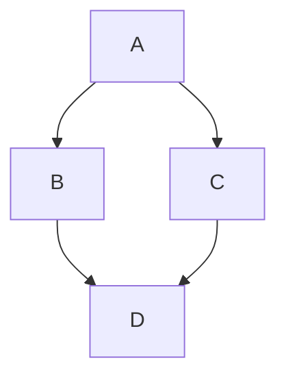

# 1.3. ООП: наследование, декораторы, паттерны

Множественное наследование и MRO. Декораторы и контекстные менеджеры.
Паттерны проектирования

---
layout: default
---

# Зачем это знать

```python
class Base:
    def process(self):
        return "A"

class Mixin:
    def process(self):
        return "B -> " + super().process()

class Combined(Mixin, Base):
    pass

print(Combined().process())
```

Результат этого кода зависит от порядка классов в объявлении
`Combined(Mixin, Base)`. Содержимого каждого класса по отдельности для
объяснения результата недостаточно. Четыре
темы сегодняшней лекции — наследование, декораторы, контекстные
менеджеры, паттерны — объединяет один навык: собирать поведение из
готовых частей, не переписывая его заново в каждом классе.

---
layout: default
---

# План на сегодня

<v-clicks>

- Множественное наследование и MRO — в каком порядке Python ищет метод
- Декораторы — как обернуть функцию или класс, не меняя их код
- Контекстные менеджеры — протокол `with` изнутри
- Паттерны проектирования — Одиночка, Фабрика, Наблюдатель

</v-clicks>

---
layout: default
---

# Напоминание: наследование

<v-clicks>

- Класс-наследник (`class Dog(Animal)`) получает все методы и атрибуты родителя
- Переопределение метода в наследнике заменяет поведение родителя для экземпляров наследника
- `super()` обращается к реализации метода из родительского класса — чаще всего внутри переопределённого метода, чтобы дополнить родительскую логику, не заменяя её полностью

</v-clicks>

```python
class Animal:
    def speak(self):
        return "звук"

class Dog(Animal):
    def speak(self):
        return "гав, а вообще: " + super().speak()

print(Dog().speak())
```

---
layout: default
---

# Зачем множественное наследование

Иногда объекту нужно поведение из двух независимых источников
одновременно: класс логирования и класс сериализации, работа с базой и
кеширование. Наследование от одного родителя не может выразить «это
одновременно то и другое» — для этого Python позволяет указать несколько
базовых классов сразу: `class X(A, B):`.

---
layout: default
---

# Миксины: что это

Если знакомы с интерфейсами из других языков (Java, C#) — миксин похож на
интерфейс, но с готовой реализацией внутри. Интерфейс описывает, что
класс должен уметь, оставляя реализацию самому классу. Миксин — это и
описание одной способности, и сразу её рабочий код: достаточно подключить
его через наследование.

---
layout: default
---

# Какое это отношение

Обычное наследование чаще всего выражает отношение «является
разновидностью»: `Dog(Animal)` читается как «собака — это вид животного».
У миксина смысл другой. `User(JSONMixin)` не означает, что пользователь —
разновидность JSONMixin: сам по себе JSONMixin не описывает никакую
сущность, только одну способность. Отношение здесь — «умеет делать», в
отличие от классического «является».

---
layout: default
---

# Пример: `JSONMixin`

```python
import json

class JSONMixin:
    def to_json(self):
        return json.dumps(self.__dict__, ensure_ascii=False)

class User(JSONMixin):
    def __init__(self, name):
        self.name = name
```

<v-click>

`self.__dict__` — словарь всех атрибутов экземпляра в виде пар «имя —
значение». `JSONMixin` сам по себе бесполезен: у него нет собственных
данных, только метод, работающий поверх атрибутов того класса, который
его подключит.

</v-click>

---
layout: default
---

# Живой пример

```py {monaco-run}
import json

class JSONMixin:
    def to_json(self):
        return json.dumps(self.__dict__, ensure_ascii=False)

class User(JSONMixin):
    def __init__(self, name):
        self.name = name

u = User("Аня")
print(u.to_json())
```

---
layout: default
---

# Несколько миксинов сразу

Практическая польза видна, когда миксинов несколько: вместо одного класса
сразу со всеми нужными возможностями можно собрать его из готовых
независимых частей.

```python
class LoggingMixin:
    def log(self, message):
        print(f"[{self.__class__.__name__}] {message}")

class User(LoggingMixin, JSONMixin):
    def __init__(self, name):
        self.name = name
```

`User` получает и логирование, и сериализацию, не имея собственного кода
ни для того, ни для другого.

---
layout: default
---

# Живой пример

```py {monaco-run}
import json

class LoggingMixin:
    def log(self, message):
        print(f"[{self.__class__.__name__}] {message}")

class JSONMixin:
    def to_json(self):
        return json.dumps(self.__dict__, ensure_ascii=False)

class User(LoggingMixin, JSONMixin):
    def __init__(self, name):
        self.name = name

u = User("Аня")
u.log("создан пользователь")
print(u.to_json())
```

---
layout: default
---

# Проблема ромба

Несколько миксинов — это уже множественное наследование, и оно не всегда
обходится без конфликтов так же гладко, как в примере выше. Если два
родителя сами наследуются от одного общего предка, а метод
переопределён в обоих, возникает вопрос: чью версию метода должен
получить класс, унаследованный сразу от обоих родителей?

```python
class A:
    def greet(self):
        return "A"

class B(A):
    def greet(self):
        return "B"

class C(A):
    def greet(self):
        return "C"

class D(B, C):
    pass
```

---
layout: default
---

# Ромб наследования



`D` связан с `A` двумя путями сразу — отсюда и название «ромб».

---
layout: default
---

# MRO

MRO — Method Resolution Order, порядок, в котором Python ищет метод среди
класса и всех его предков. Для `D(B, C)` из примера с ромбом порядок —
`D, B, C, A, object`: сначала сам класс, затем родители слева направо, но
так, что ни один класс не встречается раньше класса, от которого он сам
наследуется.

---
layout: default
---

# Живая проверка

```py {monaco-run}
class A:
    def greet(self):
        return "A"

class B(A):
    def greet(self):
        return "B"

class C(A):
    def greet(self):
        return "C"

class D(B, C):
    pass

print([c.__name__ for c in D.__mro__])
print(D().greet())
```

<v-click>

`greet()` берётся от `B` — первого класса в MRO, где этот метод вообще
определён.

</v-click>

---
layout: default
---

# C3-линеаризация

Алгоритм, который строит MRO, называется C3-линеаризацией. Разбирать его
формально не нужно — для практики достаточно одного правила: порядок,
который написан в объявлении класса (`class D(B, C)`), сохраняется в MRO,
и ни один класс не ставится раньше своего собственного родителя. Если
такое расположение логически невозможно, Python поднимает `TypeError` при
определении класса. Произвольно порядок он не выбирает.

---
layout: default
---

# `super()` идёт по MRO

```py {monaco-run}
class A:
    def greet(self):
        return "A"

class B(A):
    def greet(self):
        return "B -> " + super().greet()

class C(A):
    def greet(self):
        return "C -> " + super().greet()

class D(B, C):
    def greet(self):
        return "D -> " + super().greet()

print([c.__name__ for c in D.__mro__])
print(D().greet())
```

<v-click>

Результат — `D -> B -> C -> A`. `super()` внутри `B` вызывает не `A`
напрямую, а следующий класс по MRO — это `C`. Если бы `super()` означал
«родитель этого класса», `C` в цепочку вообще не попал бы.

</v-click>

---
layout: default
---

# К чему это приводит на практике

Нарушение этого правила — вызов родителя по имени класса напрямую
(`A.greet(self)`) вместо `super()` — работает до тех пор, пока в
иерархии нет множественного наследования. Как только класс встраивается
в более сложную иерархию, такой вызов тихо теряет часть цепочки — без
ошибки, без предупреждения, просто один из классов не вызывается.

---
layout: default
---

# Найдите ошибку

```python
class A:
    def greet(self):
        return "A"

class B(A):
    def greet(self):
        return "B -> " + A.greet(self)

class C(A):
    def greet(self):
        return "C -> " + super().greet()

class D(B, C):
    def greet(self):
        return "D -> " + super().greet()

print(D().greet())
```

Ожидается `D -> B -> C -> A` — та же цепочка, что и раньше. Класс `C`
определён правильно, через `super()`. Что получится на самом деле?

---
layout: default
---

# Разбор

```py {monaco-run}
class A:
    def greet(self):
        return "A"

class B(A):
    def greet(self):
        return "B -> " + A.greet(self)

class C(A):
    def greet(self):
        return "C -> " + super().greet()

class D(B, C):
    def greet(self):
        return "D -> " + super().greet()

print(D().greet())
```

<v-click>

Результат — `D -> B -> A`, класс `C` пропущен полностью. `B.greet()`
вызывает `A.greet(self)` напрямую, по конкретному классу, в обход MRO.
Вызов адресован `A` буквально — Python не задумывается о том, что
«следующим» по MRO должен был быть `C`.

</v-click>

---
layout: center
---

# От иерархии классов — к обёртке снаружи

Наследование и MRO решают, как поведение передаётся между классами внутри
иерархии. Следующий инструмент — декораторы — работает иначе: не через
иерархию, а оборачивая готовую функцию или класс снаружи, без изменения
их собственного кода.

---
layout: default
---

# Напоминание: функции — объекты

<v-clicks>

- Функцию можно присвоить переменной
- Функцию можно передать как аргумент в другую функцию
- Функцию можно вернуть из другой функции
- Функцию можно определить внутри другой функции

</v-clicks>

<v-click>

Это называется «функции первого класса» — с функцией можно делать то же,
что с любым другим объектом: числом, строкой, списком.

</v-click>

---
layout: default
---

# Живой пример

```py {monaco-run}
def greet():
    return "привет"

say = greet
print(say())

def apply(func):
    return func()

print(apply(greet))

def make_greeter():
    def inner():
        return "привет изнутри"
    return inner

g = make_greeter()
print(g())
```

---
layout: default
---

# Какую проблему решают декораторы

Часто нужно добавить одно и то же поведение — логирование вызова, замер
времени, проверку прав — к разным функциям, не переписывая код внутри
каждой из них. Декоратор берёт функцию, оборачивает её в дополнительную
логику и возвращает новую функцию с тем же именем — вызывающий код не
меняется.

---
layout: default
---

# Простой декоратор

```py {monaco-run}
def logger(func):
    def wrapper(*args, **kwargs):
        print(f"вызов {func.__name__}")
        return func(*args, **kwargs)
    return wrapper

@logger
def add(a, b):
    return a + b

print(add(2, 3))
```

<v-click>

`@logger` над `def add` — то же самое, что `add = logger(add)`,
выполненное сразу после определения функции.

</v-click>

<v-click>

`*args` собирает все позиционные аргументы вызова в кортеж, `**kwargs` —
именованные в словарь. Благодаря этому `wrapper` может принять любые
аргументы, не зная заранее сигнатуру обёрнутой функции.

</v-click>

---
layout: default
---

# `functools.wraps`

У каждой функции в Python есть служебные атрибуты: `__name__` хранит имя
функции строкой, `__doc__` — её docstring. Обычно об этом не задумываются
— но у обёрнутой функции (`wrapper`) эти атрибуты собственные и не
совпадают с оригинальной функцией. Если декоратор не позаботится об
этом явно, инструменты отладки, документация и интроспекция увидят не
настоящее имя функции, а слово `wrapper`.

---
layout: default
---

# Без `wraps`

```py {monaco-run}
def logger(func):
    def wrapper(*args, **kwargs):
        return func(*args, **kwargs)
    return wrapper

@logger
def add(a, b):
    """Складывает два числа."""
    return a + b

print(add.__name__)
print(add.__doc__)
```

---
layout: default
---

# С `wraps`

```py {monaco-run}
import functools

def logger(func):
    @functools.wraps(func)
    def wrapper(*args, **kwargs):
        return func(*args, **kwargs)
    return wrapper

@logger
def add(a, b):
    """Складывает два числа."""
    return a + b

print(add.__name__)
print(add.__doc__)
```

<v-click>

`functools.wraps(func)` копирует `__name__`, `__doc__` и другие метаданные
с оригинальной функции на `wrapper`. Разумная практика — добавлять его в
любой декоратор без особой причины этого не делать.

</v-click>

---
layout: default
---

# Структура обычного декоратора

```python
def decorator(func):              # уровень 1: принимает функцию
    def wrapper(*args, **kwargs):     # уровень 2: обёртка
        return func(*args, **kwargs)
    return wrapper
```

Два уровня вложенности: внешняя функция принимает декорируемую функцию,
внутренняя — её вызов.

---
layout: default
---

# А что если декоратору нужны параметры

Например, декоратор, который повторяет вызов функции N раз: число
повторений должно задаваться при использовании: `@repeat(3)` с конкретным
числом. Но `@decorator` всегда передаёт в декоратор ровно один
аргумент — саму функцию. Где взять место для числа 3?

---
layout: default
---

# Третий уровень

```python
def repeat(n):                           # уровень 1: параметры декоратора
    def decorator(func):                 # уровень 2: сама функция
        def wrapper(*args, **kwargs):    # уровень 3: обёртка
            ...
        return wrapper
    return decorator
```

<v-clicks>

- `repeat(3)` выполняется первым и возвращает `decorator`, уже «помнящий» число 3
- `@decorator` применяется к функции как обычный двухуровневый декоратор
- `wrapper` видит и `func`, и `n` одновременно

</v-clicks>

---
layout: default
---

# Целиком

```py {monaco-run}
import functools

def repeat(n):
    def decorator(func):
        @functools.wraps(func)
        def wrapper(*args, **kwargs):
            results = []
            for _ in range(n):
                results.append(func(*args, **kwargs))
            return results
        return wrapper
    return decorator

@repeat(3)
def say(msg):
    return msg

print(say("привет"))
```

---
layout: default
---

# Частая путаница

```python
@repeat(3)
def say(msg):
    ...
```

`repeat(3)` вызывается до применения декоратора и возвращает `decorator`
— именно он и применяется через `@`. Запись `@repeat` без скобок
декорировала бы функцию результатом вызова `repeat(func)`, где `func`
оказался бы на месте `n`. Параметризованный декоратор без скобок после
имени не заработает.

---
layout: default
---

# Декораторы класса

Декоратор может оборачивать не только функцию, но и целый класс —
принцип тот же: функция принимает класс и возвращает класс, тот же самый
или заменённый на что-то другое.

---
layout: default
---

# Пример

```py {monaco-run}
def add_greeting(cls):
    cls.greet = lambda self: f"Привет, я {self.name}"
    return cls

@add_greeting
class Person:
    def __init__(self, name):
        self.name = name

p = Person("Аня")
print(p.greet())
```

---
layout: default
---

# Стек декораторов

```python
@bold
@italic
def text():
    return "привет"
```

Декораторы применяются снизу вверх: сначала `italic` оборачивает `text`,
затем `bold` оборачивает результат. При вызове выполнение идёт в обратном
порядке — сверху вниз: сначала код `bold`, потом `italic`, потом сама
функция.

---
layout: default
---

# Живая проверка

```py {monaco-run}
import functools

def bold(func):
    @functools.wraps(func)
    def wrapper(*a, **kw):
        return f"<b>{func(*a, **kw)}</b>"
    return wrapper

def italic(func):
    @functools.wraps(func)
    def wrapper(*a, **kw):
        return f"<i>{func(*a, **kw)}</i>"
    return wrapper

@bold
@italic
def text():
    return "привет"

print(text())
```

---
layout: default
---

# Найдите ошибку

```python
def logger(func):
    def wrapper():
        print(f"вызов {func.__name__}")
        return func()
    return wrapper

@logger
def add(a, b):
    return a + b

print(add(2, 3))
```

Что произойдёт при вызове `add(2, 3)`?

---
layout: default
---

# Разбор

```py {monaco-run}
def logger(func):
    def wrapper():
        print(f"вызов {func.__name__}")
        return func()
    return wrapper

@logger
def add(a, b):
    return a + b

try:
    add(2, 3)
except TypeError as e:
    print("TypeError:", e)
```

<v-click>

`wrapper` не принимает аргументов, хотя исходная `add` принимает два.
Вызывающий код обращается к `wrapper` — именно он теперь живёт под именем
`add`, — и передача `2, 3` туда, где аргументы не ожидаются, выбрасывает
`TypeError`. `wrapper(*args, **kwargs)` — не стилистическое украшение, а
обязательная часть универсального декоратора.

</v-click>

---
layout: center
---

# От функции — к блоку кода

Декораторы оборачивают вызов функции. Следующий инструмент — контекстные
менеджеры — оборачивает похожим образом не вызов функции, а целый блок
кода, с гарантией, что код выхода выполнится при любом исходе.

---
layout: default
---

# Напоминание

В теме 1.1 `with` уже встречался — как надёжный способ закрыть файл, даже
если внутри блока произошло исключение:

```python
with open("data.txt") as f:
    ...
# файл закрыт здесь гарантированно
```

Сегодня — что происходит внутри `with` и как сделать такой же протокол
для собственного класса.

---
layout: default
---

# Контекстный менеджер — не только файлы

Любой объект, который умеет корректно входить в блок `with` и выходить из
него, — контекстный менеджер. Файлы — самый частый пример, но тот же
протокол подходит для соединений с базой данных, блокировок
(`threading.Lock` тоже поддерживает `with`), временных изменений
состояния, измерения времени выполнения блока кода.

---
layout: default
---

# Какую проблему это решает

```python
f = open("data.txt")
result = 1 / 0        # если здесь выбросится исключение —
f.close()               # эта строка не выполнится
```

Ручная очистка ресурса после кода, который может завершиться исключением,
требует `try`/`finally` на каждый такой случай. `with` берёт эту гарантию
на себя: код очистки выполнится при любом исходе блока, включая
исключение.

---
layout: default
---

# Протокол `__enter__` / `__exit__`

<v-clicks>

- `__enter__(self)` — выполняется при входе в блок `with`, возвращаемое значение попадает в переменную после `as`
- `__exit__(self, exc_type, exc_val, exc_tb)` — выполняется при выходе из блока, в том числе при исключении
- Если исключения не было, все три аргумента `__exit__` равны `None`

</v-clicks>

---
layout: default
---

# Свой контекстный менеджер

```py {monaco-run}
import time

class Timer:
    def __enter__(self):
        self.start = time.time()
        return self
    def __exit__(self, exc_type, exc_val, exc_tb):
        print(f"прошло {time.time() - self.start:.4f} сек")

with Timer():
    total = sum(range(1_000_000))
```

---
layout: default
---

# `contextlib.contextmanager`

Писать класс с двумя методами ради одного сценария использования часто
избыточно. `contextlib.contextmanager` превращает обычную
функцию-генератор в контекстный менеджер без отдельного класса.

---
layout: default
---

# Как это устроено

```python
from contextlib import contextmanager

@contextmanager
def managed():
    ...          # это выполнится как __enter__
    yield ...    # то, что после yield, вернётся как значение после 'as'
    ...          # это выполнится как __exit__
```

Код до `yield` — вход, значение при `yield` — то, что возвращается, код
после `yield` — выход. Функция приостанавливается на `yield` на время
выполнения тела блока `with`.

---
layout: default
---

# Живой пример

```py {monaco-run}
from contextlib import contextmanager
import time

@contextmanager
def timer():
    start = time.time()
    yield
    print(f"прошло {time.time() - start:.4f} сек")

with timer():
    total = sum(range(1_000_000))
```

---
layout: default
---

# Подавление исключения

Если `__exit__` возвращает истинное значение, исключение, возникшее
внутри блока `with`, не распространяется дальше — программа продолжает
выполняться. Если `__exit__` возвращает `None` или любое ложное значение
(поведение по умолчанию), исключение продолжает подниматься как обычно.

---
layout: default
---

# Живая проверка

```py {monaco-run}
class Suppressor:
    def __enter__(self):
        return self
    def __exit__(self, exc_type, exc_val, exc_tb):
        if exc_type is ValueError:
            print(f"подавили: {exc_val}")
            return True
        return False

with Suppressor():
    raise ValueError("упс")

print("программа продолжилась")
```

<v-click>

Строка `"программа продолжилась"` печатается, хотя внутри блока было
явное `raise`. Опасность та же, что и с `except` без разбора типа:
подавить можно больше, чем планировалось, если не проверять `exc_type`.

</v-click>

---
layout: default
---

# Несколько менеджеров в одном `with`

```python
with open("input.txt") as fin, open("output.txt", "w") as fout:
    fout.write(fin.read())
```

Через запятую — оба менеджера входят в блок в указанном порядке и выходят
в обратном. Эквивалентно вложенным `with`, но без лишнего уровня отступа.

---
layout: center
---

# От встроенного протокола — к общим решениям

Контекстные менеджеры — встроенный в язык пример более широкой идеи:
типового решения на повторяющуюся задачу. Дальше — ещё три таких решения,
уже не встроенных в язык напрямую: паттерны проектирования.

---
layout: default
---

# Что такое паттерн проектирования

Типовое решение часто повторяющейся задачи проектирования — не конкретный
код, а структура, которую можно применить в разных ситуациях с похожей
проблемой. Паттерны не привязаны к Python: те же идеи существуют в Java,
C++, Go — реализация на каждом языке своя.

---
layout: default
---

# Три паттерна сегодня

<v-clicks>

- Одиночка (Singleton) — гарантирует, что у класса есть ровно один экземпляр
- Фабрика (Factory) — создаёт объект нужного типа по параметру, скрывая выбор конкретного класса от вызывающего кода
- Наблюдатель (Observer) — оповещает заранее неизвестный список подписчиков о событии

</v-clicks>

---
layout: default
---

# Одиночка: какую проблему решает

Иногда существование больше одного экземпляра класса логически
бессмысленно или вредно — конфигурация приложения, подключение к
единственному внешнему сервису, логгер. Одиночка гарантирует: сколько бы
раз класс ни создавали, это всегда один и тот же объект.

---
layout: default
---

# Через `__new__`

```py {monaco-run}
class Config:
    _instance = None
    def __new__(cls, *args, **kwargs):
        if cls._instance is None:
            cls._instance = super().__new__(cls)
        return cls._instance

a = Config()
b = Config()
print(a is b)
```

<v-click>

`cls` в `__new__` — это сам класс, аналогично тому, как `self` в обычном
методе — конкретный экземпляр. `__new__` получает класс первым
аргументом, потому что вызывается до того, как экземпляр вообще
существует.

</v-click>

<v-click>

`__new__` — метод, который реально создаёт объект, до `__init__`.
Переопределив его, можно вернуть уже существующий экземпляр вместо
создания нового.

</v-click>

---
layout: default
---

# Одиночка через декоратор

Та же идея, оформленная как декоратор класса из предыдущего блока —
переиспользуемая версия, не требующая переопределять `__new__` в каждом
классе-одиночке отдельно.

```python
def singleton(cls):
    instances = {}
    def get_instance(*args, **kwargs):
        if cls not in instances:
            instances[cls] = cls(*args, **kwargs)
        return instances[cls]
    return get_instance
```

---
layout: default
---

# Живой пример

```py {monaco-run}
import functools

def singleton(cls):
    instances = {}
    @functools.wraps(cls)
    def get_instance(*args, **kwargs):
        if cls not in instances:
            instances[cls] = cls(*args, **kwargs)
        return instances[cls]
    return get_instance

@singleton
class Config:
    def __init__(self):
        self.value = 1

c1 = Config()
c2 = Config()
print(c1 is c2)
```

---
layout: default
---

# Фабрика: какую проблему решает

Вызывающему коду часто не нужно знать, объект какого именно класса ему
нужен — только то, что он должен уметь делать. Фабрика скрывает выбор
конкретного класса за одной функцией, которая решает это по параметру.

---
layout: default
---

# Живой пример

```py {monaco-run}
class PDFExporter:
    def export(self, data):
        return f"PDF: {data}"

class CSVExporter:
    def export(self, data):
        return f"CSV: {data}"

def exporter_factory(kind):
    exporters = {"pdf": PDFExporter, "csv": CSVExporter}
    return exporters[kind]()

e = exporter_factory("csv")
print(e.export("отчёт"))
```

---
layout: default
---

# Наблюдатель: какую проблему решает

Объект, у которого происходит событие, не должен заранее знать полный
список тех, кого нужно оповестить — список подписчиков может меняться во
время работы программы. Наблюдатель разделяет источник события и его
обработчиков: источник оповещает всех текущих подписчиков, не зная, что
каждый из них делает дальше.

---
layout: default
---

# Живой пример

```py {monaco-run}
class Publisher:
    def __init__(self):
        self._subscribers = []
    def subscribe(self, fn):
        self._subscribers.append(fn)
    def notify(self, event):
        for fn in self._subscribers:
            fn(event)

def log_subscriber(event):
    print(f"лог: {event}")

def email_subscriber(event):
    print(f"письмо: {event}")

pub = Publisher()
pub.subscribe(log_subscriber)
pub.subscribe(email_subscriber)
pub.notify("заказ оформлен")
```

---
layout: default
---

# Найдите ошибку

```python
class ShoppingCart:
    items = []   # хранит товары корзины

    def add(self, item):
        self.items.append(item)

cart1 = ShoppingCart()
cart2 = ShoppingCart()

cart1.add("яблоко")
print(cart2.items)
```

Ожидается, что `cart2` — пустая корзина, ведь товар добавляли только в
`cart1`. Что выведет этот код?

---
layout: default
---

# Разбор

```py {monaco-run}
class ShoppingCart:
    items = []

    def add(self, item):
        self.items.append(item)

cart1 = ShoppingCart()
cart2 = ShoppingCart()
cart1.add("яблоко")
print(cart2.items)
```

<v-click>

`items = []` на уровне класса — атрибут класса, общий для всех
экземпляров. У конкретного объекта своего отдельного атрибута нет, пока его
не завести явно в `__init__`. Тот же механизм, что и
изменяемое значение по умолчанию в теме 1.2: список создаётся один раз и
используется совместно. Исправление — завести список в `__init__`:

```python
def __init__(self):
    self.items = []
```

</v-click>

---
layout: default
---

# Конспект

| Тема | Суть | Когда важно |
|---|---|---|
| MRO | Порядок поиска метода при множественном наследовании | `super()` в сложной иерархии — не «вызов родителя», а переход по MRO |
| Декораторы | Функция оборачивает функцию, не меняя её код | `functools.wraps` и `*args/**kwargs` в обёртке — обязательны |
| Контекстные менеджеры | `__enter__`/`__exit__` или `@contextmanager` | Гарантированная очистка ресурса при исключении |
| Одиночка / Фабрика / Наблюдатель | Типовые решения для создания и уведомления объектов | Там, где повторяется одна и та же структурная проблема |

---
layout: center
---

# Дальше — лабораторные №3 и №4

Лабораторная №3 — декораторы и собственный контекстный менеджер.
Лабораторная №4 — три паттерна проектирования на практических задачах:
Наблюдатель, Фабрика, Одиночка.

---
layout: center
---

<script setup>
import VueQrcode from 'vue-qrcode'
</script>

# Самостоятельно

[LeetCode 1603. Design Parking System](https://leetcode.com/problems/design-parking-system/)

Небольшая практическая задача на проектирование класса — тот же навык,
что и в блоке про паттерны, без привязки к конкретному паттерну.

<VueQrcode value="https://leetcode.com/problems/design-parking-system/" :options="{ width: 250 }" class="mx-auto my-6 rounded-lg" />

---
layout: end
---

# Вопросы